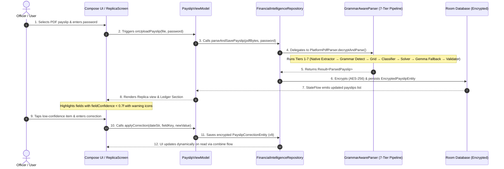
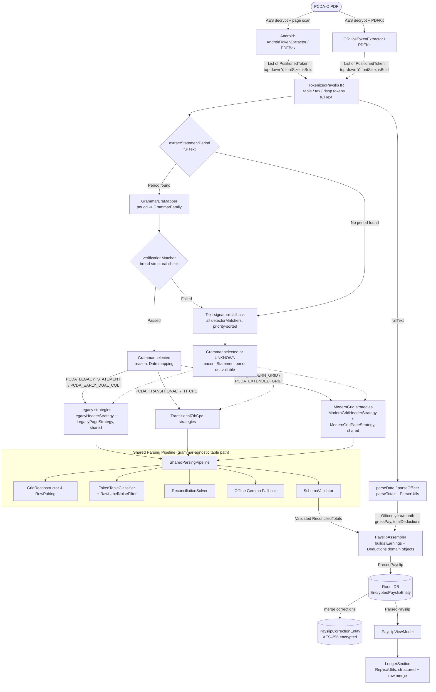

# PayslipMax — Parser & AI Insights Architecture

**One-stop reference (SSOT) for how the PCDA(O) payslip parser works end-to-end, how AI Insights are generated, and how all the pieces connect. Updated to reflect the full Token-IR re-architecture (Phases 0–6), the iOS/Android token-parity fixes, the date-primary grammar detection redesign, the raw/structured display-merge fix, and the CI-enforced iOS/Android token- and structured-field-parity gate with documented Android-only Tier 6 scoping (see [§10 SWOT](#10-swot-analysis) and [§11 Changelog](#11-changelog) for the story behind each).**

PayslipMax is an offline-first military payslip intelligence platform for Indian Army officers. It extracts structured salary data from monthly PCDA(O) PDF payslips and turns it into wealth-optimization suggestions and error-detection alerts. Everything described in this document runs on-device with no data leaving the device except for optional cloud AI inference.

---

## Table of Contents

0. [End-to-End User Interaction Lifecycle](#0-end-to-end-user-interaction-lifecycle)
1. [PDF → ParsedPayslip: 7-Tier Token-IR Pipeline](#1-pdf--parsedpayslip-7-tier-token-ir-pipeline)
2. [Stage-by-Stage: Engine Reference](#2-stage-by-stage-engine-reference)
3. [Display Layer: Structured + Raw Merge](#3-display-layer-structured--raw-merge)
4. [Confidence Scoring & Per-Field Correction UI](#4-confidence-scoring--per-field-correction-ui)
5. [Corpus Regression Safety Net](#5-corpus-regression-safety-net)
6. [Legacy String Path (Tests / Secondary)](#6-legacy-string-path-tests--secondary)
7. [Security & PII Controls](#7-security--pii-controls)
8. [AI Insights Pipeline](#8-ai-insights-pipeline)
9. [Key File Reference](#9-key-file-reference)
10. [SWOT Analysis](#10-swot-analysis)
11. [Changelog](#11-changelog)

---

## 0. End-to-End User Interaction Lifecycle

This document serves as the primary technical guide detailing how PayslipMax operates from the moment an officer interacts with the UI to the final local database storage and interactive review loop.

### Complete Interaction Sequence



---

## 1. PDF → ParsedPayslip: Version-Aware Strategy Pipeline

### High-Level Data Flow



**Important structural note** (see [§10 SWOT](#10-swot-analysis) for the full discussion): the grammar dispatch above only ever changes *header* (officer parsing) and *page* (tax/DSOP) strategy behavior. **Table/earnings-deductions extraction is grammar-agnostic** — `SharedParsingPipeline.executeTableReconciliation()` always calls the single geometry-learning `TokenTableClassifier` directly on `tokenized.tableTokens`, regardless of which grammar family won. Era-specific `IGrammarTableStrategy` implementations do not exist; the "one engine learns each document's own geometry" design is what makes the classifier era-independent in the first place.

### What Changed from the Old Monolithic Parser

| Old (monolithic token path) | New (Version-Aware Strategy Pipeline) |
|---|---|
| Handled all document layouts under a single rigid parser logic, introducing fragility and regression side-effects | Deterministic Grammar Detection Layer selects a version-specific strategy set for header/page extraction |
| Hardcoded version selectors and enums integrated into parser dispatch logic | Plugin-style `GrammarDescriptor` registry. Strategy sets are 100% stateless and side-effect free |
| Indecisive matching heuristics | **Date-primary detection**: the printed statement period (`GrammarEraMapper`) picks the family directly; incidental-text priority resolution is now only the fallback path for undated/unparseable documents |
| No standardized diagnostic output or explainability tools | Parser explainability layer emitting structured `GrammarDiagnosticReport` — family, fingerprints, active strategies, `selectionReason` ("Date mapping (Mar 2025+)" vs "Statement period unavailable; fallback detector used"), and validation status |

---

## 2. Stage-by-Stage: Engine Reference

### Stage 0 — User Ingestion & ViewModel Handshake

1. **User Action**: Officer selects a PDF file and inputs password in `UploadWidget` or `PayslipReplicaScreen`.
2. **ViewModel Dispatch**: `PayslipViewModel.onUploadPayslip()` handles asynchronous state transitions (loading/error states).
3. **Repository Execution**: Calls `FinancialIntelligenceRepository.parseAndSavePayslip(pdfBytes, password)`.
4. **Platform Binding**: Delegates directly to platform implementations (`PlatformPdfParser.decryptAndParse()`).

### Stage 1 — Platform Token Extraction

| Platform | Entry point | Library | Notes |
|----------|-------------|---------|-------|
| Android | `AndroidTokenExtractor.extractTokenized()` | PDFBox `PDFTextStripper` via `TokenScanner` | PDFBox Y is already top-down — no inversion needed |
| iOS | `IosTokenExtractor.extractTokenized()` | PDFKit `PDFPage` character-index walk | `SpatialTextExtractor` walks `numberOfCharacters`/`characterBoundsAtIndex` directly (not `page.string` + regex-index `selectionForRange`) so glyph index and bounds index never drift — the Phase 2 fix for the historical iOS/Android token-geometry divergence (see [§11](#11-changelog)) |

Both produce `TokenizedPayslip(tableTokens, taxTokens, dsopTokens, fullText)`. `PageClassifier` (commonMain SSOT) classifies each page by keyword into table / tax / DSOP buckets — no per-platform divergence.

`PositionedToken` fields: `text`, `x`, `y` (top-down), `width`, `height`, `fontSize`, `isBold`. Derived: `centerX`, `centerY`, `right`, `bottom`.

### Stage 1.5 — Date-Primary Grammar Detection & Fallback

Once the `TokenizedPayslip` IR is produced, `GrammarRegistry.detectAndSelect()` runs a two-path algorithm — this replaced a purely text-signature, priority-sorted design (see [§11](#11-changelog) for why):

```
extractStatementPeriod(fullText)          [StatementPeriodExtractor — nullable, no filename guessing]
        │
   found? ──No──► run every detectorMatcher, priority-sorted (fallback, unchanged legacy algorithm)
        │Yes
        ▼
GrammarEraMapper.mapToFamily(period) → family F   [pure date → era lookup, open-ended past Mar 2025]
        │
verificationMatcher(F) on tokenized                [broad "does this look like family F at all" check]
        │
   passed? ──No──► run every detectorMatcher, priority-sorted (fallback, with a warning)
        │Yes
        ▼
   select F   (GrammarDiagnosticReport.selectionReason = "Date mapping (<era label>)")
```

1. **Primary signal — statement period.** `StatementPeriodExtractor.extractStatementPeriod()` looks for the anchored `"STATEMENT OF ACCOUNT FOR MM/YYYY"` / `"...FOR Month YYYY"` phrase first, falling back to a bare standalone `MM/YYYY` scan only if the anchor is absent — this ordering stops an unrelated date elsewhere on the page (e.g. a DSOP loan due-date) from being mistaken for the statement period. Returns `null` (not a guess) when nothing is found.
2. **Era mapping.** `GrammarEraMapper` is the single source of truth for era boundaries:

   | Statement period | `GrammarFamily` |
   |---|---|
   | `< Jan 2015` | `PCDA_LEGACY_STATEMENT` |
   | `Jan 2015 – Dec 2017` | `PCDA_EARLY_DUAL_COL` |
   | `Jan 2018 – Oct 2023` | `PCDA_TRANSITIONAL_7TH_CPC` |
   | `Nov 2023 – Feb 2025` | `PCDA_MODERN_GRID` |
   | `Mar 2025 →` (open-ended) | `PCDA_EXTENDED_GRID` |

   The open upper bound is what makes new months parse correctly with zero code changes.
3. **Verification, not re-matching.** The date-selected descriptor's `verificationMatcher` runs — a deliberately *broad* sanity check (e.g. for both grid families, just "does `BPAY` appear anywhere"), never the fine-grained *distinguishing* signature. This is the actual fix for the Mar-2025 misdetection bug: the old `matchExtendedGrid` required literal `"ARR-"` (arrears) text, so a Mar-2025+ payslip with no arrears that month failed it and silently fell back to `PCDA_MODERN_GRID`. Verification and fallback-distinguishing are now two separate concerns (`GrammarDescriptor.verificationMatcher` vs `.detectorMatcher`).
4. **Fallback path (dateless documents only).** Unchanged legacy algorithm: every registered `GrammarDescriptor.detectorMatcher` runs, priority-sorted descending (`50` Extended → `10` Legacy), highest priority match wins; `GrammarFamily.UNKNOWN` if nothing matches.
5. **Diagnostics telemetry.** `GrammarDiagnosticReport` carries `selectedFamily`, `selectedPriority`, `matchedFingerprints`, `rejectedCandidates`, `selectedStrategies`, `validationStatus`, and `selectionReason` — e.g. `"Date mapping (Mar 2025+)"` + `"Signature verification: Passed"`, or `"Statement period unavailable; fallback detector used"`.

### Stage 2 — Grid Reconstruction (`GridReconstructor` → `engine.TableReconstructionEngine`)

Clusters `tableTokens` into a 2D grid, entirely per-document (no hardcoded pixel values):

- **`RowDetector`**: clusters by y; `rowTolerance = max(3, medianHeight × 0.25)`.
- **`ColumnBoundaryDetector`**: finds x-alignment peaks recurring across ≥2 rows, merges peaks < 85pt apart into one column band.
- **`TokenGridAssigner`**: assigns every token to its nearest band, then sub-clusters within a band by x-gap / amount-vs-text type mismatch into individual cells.

Translation-invariant: shifting the whole table 120 px produces identical rows.

**Known pathology 1** (Bug — Feb 2025): when the credit-total amount token sits < cellGap from an adjacent Hindi label token, they merge into one cell, e.g. `"271739 kuula kTaOtI"` gets paired with amount `109310`. Fixed in `TokenTableClassifier.toCandidate()` (digit-only label after Hindi negation is dropped) — see Stage 4.

**Known pathology 2** (`ColumnBoundaryDetector`, latent): the < 85pt peak-merge threshold can swallow a genuinely distinct column's alignment peak into an adjacent one when two columns sit closer than that (observed on a real 4-column PCDA row where the debit-label peak was only ~60pt from the credit-amount peak). In the cases traced this didn't corrupt the final result because `RowPairing` and `TokenTableClassifier` re-derive geometry independently of `ColumnBoundaryDetector`'s band identities, but it's an open item — see [§10 SWOT — Weaknesses](#10-swot-analysis).

### Stage 3 — Row Pairing (`RowPairing`)

Within each reconstructed row, pairs a run of leading text cells (the label) with the next numeric cell (the amount) using an overwrite-pending heuristic — robust to a row carrying both a credit pair and a debit pair side by side. `RowPairing.parseAmount()` rejects dates (`01/2024`), trailing dots (`1.`), and currency prefixes (`Rs.1,39,604`).

**Known pathology 3** (Mar 2025 real-payslip investigation): a page-footer disclaimer sentence ("This payslip is computer generated. Hence no signature is required...") can get paired by this same nearest-label heuristic with a stray nearby number (a page marker), producing a phantom `(hugeLabel, 1.0)` pair. Handled at classification time — see Stage 4.

### Stage 4 — Token Table Classification (`TokenTableClassifier`)

Content-driven classifier — never geometry-hardcoded:

1. **Match** each label against `PayslipPatternConfig.creditKeysMapping` / `debitKeysMapping` (SSOT — reuse, never copy).
2. **Learn** this document's credit-label and debit-label x-bands as the **median** x of cleanly-matched labels.
3. **Assign** ambiguous / unmatched labels by proximity to learned bands; labels farther than `acceptRadius = |debitBand − creditBand| / 2` are dropped (catches the "Details of Transactions" column). Single-column layouts (`bandSeparation < 20pt` — e.g. iOS PDFKit coordinate collapse) trust the matched key's own canonical side instead of geometry.

`toCandidate()` guards, in order:
- `normalized.isBlank()` → null (pure whitespace after Hindi negation)
- `normalized.none { it.isLetter() }` → null (**pathology 1 fix**: drops pseudo-labels like `"271739"` that are digit-only after Hindi words are removed)
- `normalized in normalizedBlocklist` → null (known non-payslip words: `"page"`, `"date"`, month names, table headers, etc.)
- `RawLabelNoiseFilter.isProseNoise(normalized)` (only for **unmatched** candidates) → null (**pathology 3 fix**: no legitimate PCDA line-item label is anywhere near an 11-word disclaimer sentence — the longest known key is ~5 words / 25 chars — so an unmatched candidate over 60 chars / 8 words is footer noise, not a real if-unrecognized row)

`negateHindiTransliterations()` (case-insensitive whole-word scan via `WholeWordScanner.replaceWholeWordIgnoreCase` — an `indexOf`-based construct, not a lookaround regex; see [§11](#11-changelog) for why) strips Hindi transliteration tokens (`kuula`, `Aaya`, `kTaOtI`, etc.) before classification.

Output: `ClassifiedTable` → `credits: List<ClassifiedEntry>` + `debits: List<ClassifiedEntry>` + `rawCredits()` / `rawDeductions()`.

### Stage 5 — Confidence & Reconciliation Solver (`ReconciliationSolver`)

Routes each `ClassifiedEntry` into the right map using cross-column routing rules, calculates confidence scores (`fieldConfidence`), performs mandatory field integrity auditing, and flags ambiguous parses (`needsReview = true`).

| Entry | Route |
|-------|-------|
| Matched key, correct column | `earningsMap[standardKey]` / `deductionsMap[standardKey]` |
| Debit key stranded in credit column (ledger carry key) | `deductionsMap[matchedKey]` (ledger entry) |
| Debit key stranded in credit column (credit reversal key) | `earningsMap["adjPayAndAllce"]` |
| Credit key stranded in debit column | `deductionsMap[recoveryTargetFor(matchedKey)]` (recovery) |
| Unmatched | `rawEarnings[rawLabel]` / `rawDeductions[rawLabel]` |

**Structured (`earningsMap`/`deductionsMap`) and raw (`rawEarnings`/`rawDeductions`) are populated disjointly** — `route()` books every entry into exactly one of the four maps, never both. This invariant is what [§3](#3-display-layer-structured--raw-merge)'s display fix relies on.

#### Mandatory Domain Field Integrity Audit
`ReconciliationSolver.solve(...)` verifies the presence of strictly mandatory domain fields defined in `PayslipPatternConfig`:
* **Strictly Mandatory Credits**: `basicPay` (`BPAY`), `dearnessAllowance` (`DA`), `militaryServicePay` (`MSP`).
* **Strictly Mandatory Debits**: `agif` (`AGIF`), `dsopSubscription` (`DSOP`).

If any mandatory field is missing from the extracted maps, a **50% confidence penalty** is applied to overall confidence, and `needsReview = true` is flagged to trigger Tier 6 Gemma fallback for structured recovery.

### Stage 6 — Tier 6 Offline Gemma Fallback (`GemmaFallbackExtractor` & `GemmaEngine`)

When spatial confidence rules encounter ambiguity (`solved.needsReview == true`, or `solved.rawEarnings`/`solved.rawDeductions` are non-empty):
1. **On-Demand Storage & Download Lifecycle**: The quantized Gemma model binary (`gemma-3-1b-it-int4.task`, ~650MB) is managed locally via `GemmaModelStorageManager`. Users trigger on-demand background streaming via `GemmaModelDownloadManager` directly from app settings.
2. **Hardware Capability Gate**: `DeviceCapabilityManager` (`expect/actual` in KMP) inspects host hardware before model load, verifying RAM ≥ 3.5GB and free disk space ≥ 1.5GB.
3. **Platform Binding & Runtime**: `PlatformPdfParser` (Android) verifies binary readiness in app storage (`context.filesDir`) and instantiates `GemmaEngine` wrapping the native Google MediaPipe LLM Inference SDK.
4. **Prompt & Response Contract**: `GemmaPromptBuilder` formats unresolved token labels into a deterministic prompt. `GemmaEngine` executes local asynchronous inference, and `GemmaResponseParser` safely parses JSON extractions into standard ledger keys (`BPAY`, `DA`, `ITAX`, `DSOP`, etc.).
5. **Standby Optimization**: If Tiers 1–5 achieve full mathematical reconciliation with no raw leftovers, Tier 6 inference stays on standby to preserve device battery and thermals.
6. **Android-only by design.** `iosMain/.../PdfParser.kt` never constructs a `GemmaFallbackExtractor`, so `GrammarAwareParser` always runs Tiers 1–5 and 7 only on iOS — MediaPipe has no iOS/Kotlin-Native artifact, and a real port (ONNX Runtime Mobile or Apple's on-device Foundation Models) is a separate multi-week initiative tracked in `docs/ai_insights_adoptgemma.md`, not undertaken here. The iOS `actual GemmaEngine` (`GemmaEngine.ios.kt`) exists only to satisfy the `expect`/`actual` contract and always returns `Result.failure` from `generateResponse` — it does **not** run real inference, so it must never be wired into `PlatformPdfParser` without first implementing a real runtime.

Note: `applyGemmaFallback` resolves *per side* — if Gemma's response has a non-empty `earnings` (or `deductions`) object, that whole side's raw map is cleared (its prompt received the complete raw map for that side and has no back-reference to which raw label produced which key, so per-key removal isn't possible); a side Gemma returned nothing for is left untouched. What's left in `rawEarnings`/`rawDeductions` after fallback is exactly what flows to `ParsedPayslip`, and (post-fix) is always shown *alongside* the structured breakdown in the UI, not instead of it — see [§3](#3-display-layer-structured--raw-merge).

### Stage 7 — Tier 7 Schema Validator (`SchemaValidator`)

Acts as the final gatekeeper verifying mathematical accounting invariants across extracted figures (`TOLERANCE = 2.0`):
- `grossMismatch = |grossPay - creditsSum| <= 2.0`
- `deductionsMismatch = |totalDeductions - debitsSum| <= 2.0`
- `netResidual = |(grossPay - totalDeductions) - netRemittance| <= 2.0`

If `isValid == false`, the parse is preserved but flagged with `needsReview = true` for Phase 5 user correction UI.

### Stage 8 — Domain Assembly (`PayslipAssembler`)

Maps validated `earningsMap` → `Earnings` struct + `miscEarnings`, and `deductionsMap` → `Deductions` struct + `miscDeductions`. Serializes and commits `ParsedPayslip` to local Room DB via `EncryptedPayslipEntity` (AES-256).

### Stage 9 — Interactive Review & Encrypted Persistence

1. **Reactive Render**: `PayslipViewModel` emits updated `ParsedPayslip` to `PayslipReplicaScreen` and `LedgerSection`.
2. **Low-Confidence Alerting**: Fields with `fieldConfidence < 0.7f` render with `AppColors.Warning` warning icons.
3. **User Correction Dialog**: Tapping an item opens `LedgerCorrectionDialog` allowing manual value entry.
4. **Encrypted Overlay Persistence**: `repository.saveCorrection(dateStr, fieldKey, newValue)` stores an encrypted `PayslipCorrectionEntity` (v9). Applied seamlessly on read via `combine` flow without mutating raw parsed ground truth.

---

## 3. Display Layer: Structured + Raw Merge

`ReplicaUtils.getCreditsList(payslip)` and `getDebitsList(payslip)` build the ledger rows shown in `PayslipReplicaScreen`.

### Structured + raw are always merged (not either/or)

```kotlin
internal fun getCreditsList(payslip: ParsedPayslip): List<LedgerLine> {
    val items = structuredCreditLines(payslip.earnings) + rawCreditLines(payslip.rawEarnings)
    // ... MISC residual fallback below
}
```

Because `ReconciliationSolver.route()` (Stage 5) populates `earnings`/`deductions` and `rawEarnings`/`rawDeductions` **disjointly** — an item is never in both — the displayed ledger is always their union. `structuredCreditLines()` returns explicit `LedgerLine` rows for every standardized `Earnings` field with `amount ≠ 0.0` (30+ domain fields including pay adjustments and arrears: `adjPayAndAllce`, `arrearsDa`, `adjDa`, `recFieldAllowance`, `recoveryOfDebits`, etc.). `rawCreditLines()` adds any genuinely unmatched raw entries the parser couldn't standardize.

**This was a real production bug, fixed after real-payslip diagnosis** (see [§11](#11-changelog)): the previous implementation branched `if (rawEarnings.isEmpty()) show structured else show raw only`. A single unrelated entry in `rawEarnings` — e.g. a footer disclaimer mis-paired with a stray page number (Stage 3/4 pathology 3) — was enough to discard an otherwise fully and correctly itemized structured breakdown, replacing it with just that one noise row plus a synthetic MISC line covering the entire gross pay. The fix removed the branch entirely; both sources are always combined.

### Universal MISC Residual Balancing (applies after the merge)

```kotlin
val totalItemSum = items.sumOf { it.amount }
val residual = payslip.summary.grossPay - totalItemSum
if (residual > ConfidenceThresholds.ITEM_SUM_TOLERANCE && items.none { it.code == "MISC" }) {
    items + LedgerLine("MISC", residual, getCreditDesc("miscEarnings"), "miscEarnings")
}
```

This guarantees that for any unlisted custom pay code or residual gap, the displayed table lines always reconcile to `grossPay` and `totalDeductions` with 100% mathematical precision. The MISC row uses `"miscEarnings"` or `"miscDeductions"` as `fieldKey` for SSOT correction-flow compatibility. Because structured + raw are now always merged first, this residual is what's *actually* unaccounted for — not an artifact of the display layer discarding a correct parse.

### Mismatch Banner (phantom over-count)

```kotlin
internal fun creditsMismatch(payslip: ParsedPayslip): Double =
    getCreditsList(payslip).sumOf { it.amount } - payslip.summary.grossPay

internal fun debitsMismatch(payslip: ParsedPayslip): Double =
    getDebitsList(payslip).sumOf { it.amount } - payslip.summary.totalDeductions
```

After MISC absorb, `mismatch > 0` only when items **over-count** the printed total (phantom entry). `LedgerSection` passes both values to `LedgerTableFooter`. When either exceeds `ConfidenceThresholds.ITEM_SUM_TOLERANCE (= 2.0)`, `LedgerMismatchBanner` renders an `AppColors.Warning` chip showing the over-count amount.

**Tolerance SSOT**: `ConfidenceThresholds.ITEM_SUM_TOLERANCE` (shared domain object) is the single constant used by both the MISC absorb decision and the banner threshold.

### `isValidRawKey` — Display Guard (defense-in-depth)

```kotlin
private fun isValidRawKey(key: String): Boolean {
    val afterHindi = key.lowercase().split(Regex("\\s+"))
        .filterNot { it in hindiWordSet }.joinToString(" ").trim()
    return afterHindi.any { it.isLetter() }
}
```

Filters raw map entries whose keys are digit-only or Hindi-word-only after stripping. Defends against any stale DB records that bypassed the parser-layer fix. Note this is a *letter presence* check, not a length check — the prose-noise-length guard (`RawLabelNoiseFilter`) lives upstream in `TokenTableClassifier` (Stage 4), so noise like the footer disclaimer is dropped before it ever reaches `rawEarnings`, not merely tolerated here.

---

## 4. Confidence Scoring & Per-Field Correction UI

### Confidence Flow

```
ReconciliationSolver.scoreConfidence()
    → ParsedPayslip.fieldConfidence: Map<String, Float>
    → ParsedPayslip.needsReview: Boolean

ReconciliationSolver.solve() / applyGemmaFallback()
    → ParsedPayslip.fieldSource: Map<String, FieldSource>   (GEOMETRY | GEMMA_FALLBACK)

ConfidenceThresholds.REVIEW_THRESHOLD = 0.7f  (SSOT)
ParsedPayslip.isFieldLowConfidence(fieldKey)   (extension, ConfidenceThresholds.kt)
```

`fieldSource` is a provenance sidecar parallel to `fieldConfidence`: every field starts tagged `GEOMETRY` in `ReconciliationSolver.solve()`, and `applyGemmaFallback` (`PayslipTokenParser.kt`, shared by both `PayslipTokenParser` and `SharedParsingPipeline`) re-tags any key it merges in from Tier 6 to `GEMMA_FALLBACK`. This closes the SWOT weakness below — the UI/auditors can now tell "the geometry solver was certain" apart from "Gemma inferred this" instead of both collapsing into the same `fieldConfidence` number.

`applyGemmaFallback` also writes `fieldConfidence[key] = ConfidenceThresholds.GEMMA_FALLBACK_CONFIDENCE` (0.5f, a fixed floor below `REVIEW_THRESHOLD`, not a formula derived from pre-Gemma confidence) for every key it promotes, and clears the resolved side's raw map (see [§2 Stage 6](#stage-6--tier-6-offline-gemma-fallback-gemmafallbackextractor--gemmaengine)). Both are load-bearing: a promoted key with no `fieldConfidence` entry read as "certain" under `isFieldLowConfidence`'s missing-entry default, silently suppressing the review indicator for exactly the fields that most need it; and a promoted key left in the raw map was double-counted by `getCreditsList`/`getDebitsList` and by `SchemaValidator`'s `creditsSum`/`debitsSum` (both sum `earningsMap`/`deductionsMap` *plus* `rawEarnings`/`rawDeductions`).

### Correction Persistence

`PayslipCorrectionEntity(dateStr PK, ciphertext)` stores AES-256-encrypted `Map<String, Double>` via `CryptoHelper`. DB schema v9 (auto-migration from v8). Corrections are:
- **Applied on read** via `combine` in `getAllPayslips()` / `getPayslipByDate()` → `ParsedPayslip.applyCorrections(Map<fieldKey,Double>)`.
- **Never mutate the original parse** — stored separately so re-parsing (e.g. on engine improvement) can overwrite only the parsed side.
- Keyed by field name first (`applyEarningsCorrection`/`applyDeductionsCorrection` match known structured field names), falling through to `rawEarnings`/`rawDeductions` only for keys that aren't a recognized structured field — corrections never write into both maps for the same conceptual item, preserving the disjoint invariant Stage 5 and [§3](#3-display-layer-structured--raw-merge) depend on.

### UI Wiring

```
LedgerRowItem         → shows AppColors.Warning Info icon when isFieldLowConfidence(fieldKey)
LedgerCorrectionDialog → inline edit dialog (per-field)
PayslipReplicaScreen  → onCorrectField → PayslipViewModel.applyCorrection()
PayslipViewModel      → repository.saveCorrection(dateStr, fieldKey, newValue) + updates selectedPayslip
```

`LedgerLine.fieldKey` is the SSOT bridge between display and correction:
- Structured path: domain field name (e.g. `"basicPay"`, `"incomeTax"`)
- Raw path: raw PDF label (e.g. `"BONUS X"`, `"RH12"`)

---

## 5. Corpus Regression Safety Net

**Purpose**: makes "fix one month, break another" structurally impossible.

### Fixture Layout

```
shared/src/androidUnitTest/resources/corpus/
    <id>.input.json     ← scrubbed full-text / column texts (input, legacy string path)
    <id>.tokens.json    ← scrubbed positioned tokens (input, token path — Android/PDFBox)
    <id>.expected.json  ← human-verified ParsedPayslip JSON (expected output)
shared/src/androidUnitTest/resources/corpus_ios_tokens/
    <id>.tokens.json    ← scrubbed positioned tokens (input, token path — iOS/PDFKit), captured
                           via IosTokenCaptureTest on a real device/simulator, committed so the
                           iOS/Android parity tests below run on the JVM with no live device
```

52 fixtures covering Jan 2022 – Apr 2026 (4 per month across eras, including the Nov/Dec transition and Mar 2025 boundary), plus the matching 52 committed iOS token dumps above. De-identified by `CorpusScrubber`:
- Name → `Officer Officer Officer`
- Account → `16/000/000000X`
- PAN → `AR*****90G`
- Email → scrubbed
- Numbers untouched

### Always-On Tests

| Test | Scope | What it checks |
|------|-------|----------------|
| `TokenParseCorpusRegressionTest` | androidUnitTest | Drives the **production engine** `GrammarAwareParser.parse` over all 52 fixtures vs `expected.json` — this is the primary regression gate |
| `PayslipCorpusRegressionTest` | androidUnitTest | Legacy text-path `PayslipTextParser.parse` vs ground truth for all 52 fixtures — keeps the secondary path from silently rotting |
| `TokenCorpusRegressionTest` | androidUnitTest | Token fixture well-formedness (52 `.tokens.json` files) |
| `TokenEngineCorpusTest` | androidUnitTest | Pure token engine (`GridReconstructor → RowPairing → TokenTableClassifier`) against real de-identified fixtures — unambiguous single-row fields only (BPAY, DA, MSP, core deductions); reversals/arrears/misc are Stage 5's job, intentionally out of scope here |
| `TokenTableEngineTest` | commonTest | Synthetic token layout tests: translation-invariance, Hindi-merge regression, single-column-layout regression, prose-footer-noise regression |
| `GrammarRegistryTest` | commonTest | Date-primary era boundaries (pre-Oct-2023, Oct/Nov 2023 transition, Feb/Mar 2025 transition, future months, dateless fallback) |
| `GrammarEraMapperTest` / `StatementPeriodExtractorTest` | commonTest | Pure unit tests for the era-boundary lookup and period-parsing helpers |
| `ReplicaUtilsMismatchTest` / `ReplicaUtilsTest` | commonTest | MISC row appearance, `creditsMismatch`/`debitsMismatch` helpers, structured+raw merge regression |
| `TokenParityDiffTest` | androidUnitTest | **CI-enforced iOS/Android token parity.** Compares the committed Android token corpus against the committed `corpus_ios_tokens/` iOS dump for all 52 ids: asserts per-section (table/tax/dsop) token-*content* parity (order-insensitive multiset diff, small documented benign-tokenization tolerance) for every id outside `CorpusQuarantine`; reports per-token geometry (dx/dy/dHeight) informationally only, since PDFBox/PDFKit apply a small, consistent, already-accepted font-metrics offset. No env vars — both fixture sets are committed, so this runs by default, unlike the manual/report-only check it replaced. |
| `IosTokenParseCorpusRegressionTest` | androidUnitTest | **CI-enforced iOS/Android structured-field parity.** Builds a `TokenizedPayslip` from each committed iOS token dump, runs it through the same production `GrammarAwareParser.parse`, and diffs against the same `<id>.expected.json` ground truth used for the Android corpus (±1.0 tolerance), for every id outside `CorpusQuarantine`. This is the strongest available proof — short of a live device run — that iOS and Android parse a given payslip to the same salary numbers through the identical `SharedParsingPipeline` code path. |
| `ParserUtilsIosPerfTest` | iosTest | **CI-enforced Kotlin/Native performance guard.** Runs `negateHindiTransliterations`/`parseTotals` on the real Kotlin/Native regex engine at 12KB/17KB synthetic inputs (matching the two real documents from the [§11](#11-changelog) diagnosis), asserting an absolute time bound plus a coarse linearity check (larger input ≤~2× the smaller one's time) so a regression back to quadratic-shaped matching fails even if still under the absolute bound. This is the only test in the suite that exercises this `commonMain` code on Native rather than JVM — the JVM-backed tests above could not have caught the bug this guards against. Runs via `iosSimulatorArm64Test` in CI's `kmp-ios-ci` job (`macos-latest`), separate from the primary `check` task. |

`CorpusQuarantine` (`androidUnitTest/.../parser/corpus/CorpusQuarantine.kt`) is the single reviewed list of ids with a known, empirically-verified platform token divergence (legacy DSOP-page era: all 2022 + Jan–Oct 2023, 22 ids) — shared by both parity tests above rather than duplicated, per the project's SSOT rule.

### Opt-In Local / Integration Tests (never in CI)

| Test | Trigger | What it does |
|------|---------|---------------|
| `CorpusCaptureTest` | `-Dpayslip.localCorpus=<path>` | Runs the real pipeline over PDFs at `~/Desktop/Pay Slip Elements`, writes scrubbed fixtures. Gated; no PII ever committed. |
| `PlatformPdfParserTest.verifyRealPayslipsAgainstGroundTruth` | `-Dpayslip.localCorpus=<dir>` + `-Dpayslip.localCorpus.json=<ground-truth-file>` | Full end-to-end integration: decrypts and parses every real PDF under the local corpus directory and diffs every field against a hand-verified JSON, at **±1.0 tolerance** (tightened from ±5.0 — the looser tolerance was hiding small 0-vs-small-value extraction errors) |
| `IosTokenCaptureTest` / `PlatformPdfParserIosTest` (iosTest) | `PAYSLIP_LOCAL_CORPUS` env var | iOS-side capture/integration equivalents. `IosTokenCaptureTest` is how the committed `corpus_ios_tokens/` dumps above were produced in the first place (run once per corpus update, output scrubbed and committed) — it is not required for day-to-day CI, since the parity tests above run against the already-committed dump. |

---

## 6. Legacy String Path (Tests / Secondary)

`PayslipTextParser` + `DynamicSpatialParser` + `ParserUtils.splitCreditDebitSections` remain in the codebase as the **secondary** path. They are:
- Off the production parse path (both Android and iOS call `GrammarAwareParser` via the token path — see [§9](#9-key-file-reference) for the `PayslipTokenParser` dead-code note).
- Backed by the `PayslipCorpusRegressionTest` text-fixture regression suite (ensures the old path remains stable for comparison).
- Used by the opt-in `CorpusCaptureTest` capture utility.

Removing the string path entirely requires migrating those tests to the token path — deferred as a clean-up task.

**Deleted in Phase 4:**
- `DynamicSpatialParser.applyHistoricalOverrides()` — per-month fudge factors gone.
- iOS string crop (`IosLayoutScanner.kt`, `extractTextSpatially`) — 134 lines deleted.
- Hard-fail `Result.failure` reconciliation — replaced by `netResidual` + `needsReview`.

**Deleted in a later cleanup pass:**
- The `IGrammarTableStrategy` stub cluster — every implementation returned `emptyMap()` and `SharedParsingPipeline` never called it; removed rather than left as dead abstraction (see [§10 SWOT](#10-swot-analysis)).

---

## 7. Security & PII Controls

| Control | Implementation |
|---------|----------------|
| Payslip data at rest | AES-256 via `CryptoHelper` (Android Keystore / iOS Keychain) → `EncryptedPayslipEntity` |
| Corrections at rest | Same `CryptoHelper` → `PayslipCorrectionEntity` (DB v9) |
| Auto-Backup disabled | `allowBackup="false"` in AndroidManifest — prevents restoring DB without hardware-bound key |
| Self-healing decryption | Falls back to legacy key on `BAD_DECRYPT`; clears corrupt data rather than bricking |
| Committed fixtures | `CorpusScrubber` strips all PII before commit; only `AR*****90G` / `16/000/000000X` placeholders remain |
| PDF password | Removed hardcoded default from UI (`UploadWidget`, `SettingsScreen`) — field starts empty |
| Opt-in capture | System-property-gated (`-Dpayslip.localCorpus`); never writes real PII to committed resources |
| Debug diagnostics | `ParserDebugCollector` (Stage 1–5 dumps: tokens, grid rows, column bands, field classification, reconciliation) is opt-in and never wired into the production parse call — used only from local/test tooling |
| PII in git history | Real name/account remained in history pre-Phase 6; a leaked-artifact scrub commit removed committed PII source. Destructive `filter-repo`/BFG rewrite of full history deferred (user decision required) |

---

## 8. AI Insights Pipeline

AI Insights layer sits above `ParsedPayslip` — it consumes already-parsed, already-stored payslip data.


### Deterministic Rules Engine

`DeterministicIntelligenceEngine` orchestrates specialized `RuleAuditor` implementations:

| Auditor | What it checks |
|---------|---------------|
| `DaArrearsAuditor` | Mathematical DA adjustment progression |
| `MarriedQuartersRiskAuditor` | Retroactive rent recovery risk |
| `UnexpectedDebitAuditor` | Abnormal ledger recovery spikes |
| `DsopComplianceAuditor` | 6% statutory minimum savings; ₹41,666/mo tax threshold |
| `TaxProjectionAuditor` | Annual ITAX trajectory from YTD |
| `SalaryLossAuditor` | Unexplained net-pay drops |
| `MissingAllowanceAuditor` | Allowances present in past but absent this month |
| `TptaEntitlementAuditor` | Transport allowance entitlement vs received |

`InsightPrioritizationEngine` scores alerts on 5 dimensions, filters below 7.0, caps dashboard at top 4, uses ₹ value as tie-breaker.

**Direct dependency on parser quality**: every one of these auditors reads `ParsedPayslip.earnings`/`.deductions`/`.rawEarnings` history across months. The [§3](#3-display-layer-structured--raw-merge) display bug did not corrupt the underlying `ParsedPayslip` data these auditors consume (only the UI rendering), but a genuine upstream misclassification (Stage 4/5) would silently skew `MissingAllowanceAuditor` and `SalaryLossAuditor` in particular, since both compare a field's value against its own history.

### AI Provider Abstraction

`AIInsightProvider` interface isolates business logic from model execution:
- `GeminiCloudProvider` — cloud inference (active).
- `LocalGemmaProvider` — on-device (placeholder → upgraded to dynamic `AiInsightReport` JSON construction).
- `AIProviderManager` — selects provider; toggleable via Settings (`useLocalAi` preference, DB schema v7).

---

## 9. Key File Reference

### Parser Core (shared/commonMain)

| File | Role |
|------|------|
| `parser/detection/GrammarFamily.kt` | Descriptive grammar family identifiers (Legacy, EarlyDualCol, Transitional, Modern, Extended) with era doc-comments — the canonical era-to-family mapping reference |
| `parser/detection/StatementPeriod.kt` | `data class StatementPeriod(month, year)` + monotonic `ordinal` for range comparisons |
| `parser/detection/StatementPeriodExtractor.kt` | Pure, nullable statement-period parser (anchored phrase → standalone date; no filename fallback) — SSOT shared with `ParserUtils.parseDate` |
| `parser/detection/GrammarEraMapper.kt` | SSOT era-boundary lookup: `StatementPeriod → GrammarFamily`, open-ended past Mar 2025 |
| `parser/detection/GrammarMatchResult.kt` | Encapsulates matched fingerprints and rejected reasons for a document stream |
| `parser/detection/GrammarDiagnosticReport.kt` | Diagnostic report: family, fingerprints, selected strategies, `selectionReason`, validation status |
| `parser/registry/GrammarDescriptor.kt` | Plugin container: family, priority, `detectorMatcher` (fallback-path matching), `verificationMatcher` (date-path sanity check, defaults to `detectorMatcher`), strategy bindings |
| `parser/registry/GrammarRegistry.kt` | Date-primary detection with priority-based text-signature fallback (see [§2 Stage 1.5](#stage-15--date-primary-grammar-detection--fallback)) |
| `parser/registry/DefaultGrammarDescriptors.kt` | Registers the 5 default descriptors; per-family `detectorMatcher`s + shared `matchGridStructural` verification for the two grid families |
| `parser/pipeline/PipelineContext.kt` | Immutable state context passing inputs and intermediate results through the pipeline layers |
| `parser/pipeline/SharedParsingPipeline.kt` | 7-layer orchestrator coordinating grammar detection, strategy execution (header/page only), and reconciliation |
| `parser/GrammarAwareParser.kt` | Entry facade delegating parse execution to `SharedParsingPipeline` with diagnostics — this is the production engine on both platforms |
| `parser/strategy/` | Header/page strategy contracts. **Table strategy dispatch does not exist** — table extraction is always the shared `TokenTableClassifier`, not a per-grammar strategy. `ModernGridStrategySet`/`ExtendedGridStrategySet` and `LegacyStatementStrategySet`/`EarlyDualColStrategySet` are each two distinct `object`s wired to the *same* underlying header/page strategy instances (documented, intentional — not yet differentiated) |
| `parser/PositionedToken.kt` | Token IR data class (text, x, y, width, height + derived helpers) |
| `parser/PageClassifier.kt` | SSOT page-type detection (table / tax / DSOP) by keyword |
| `parser/GridReconstructor.kt` | Delegates to `engine/TableReconstructionEngine`; clusters tokens → 2D grid |
| `engine/RowDetector.kt`, `engine/ColumnBoundaryDetector.kt`, `engine/TokenGridAssigner.kt` | Generic row clustering, column-band peak detection, token→cell assignment — the actual geometry-learning core `GridReconstructor` delegates to |
| `parser/RowPairing.kt` | Row-local label→amount pairing; `parseAmount()` rejection rules |
| `parser/RawLabelNoiseFilter.kt` | Prose-length guard dropping footer/disclaimer text mis-paired with a stray number before it reaches `rawEarnings`/`rawDeductions` |
| `parser/TokenTableClassifier.kt` | Content-driven credit/debit classification; learns x-bands per document; grammar-agnostic |
| `parser/ReconciliationSolver.kt` | Cross-column routing; confidence scoring; `needsReview` flag; disjoint `earningsMap`/`rawEarnings` population |
| `parser/GemmaFallbackExtractor.kt` | Tier 6 fallback extraction service wrapping `GemmaEngine` runtime |
| `parser/GemmaPromptBuilder.kt` | Formats extraction prompts mapping unresolved tokens to standard keys |
| `parser/GemmaResponseParser.kt` | Safely parses structured JSON responses from Gemma offline fallback |
| `parser/SchemaValidator.kt` | Final gatekeeper verifying exact mathematical accounting invariants |
| `parser/ReconciliationEngine.kt` | Ledger carry-over extraction; `miscEarnings`/`miscDeductions` computation |
| `parser/PayslipAssembler.kt` | `earningsMap` + `miscEarnings` → `Earnings` domain object; final `ParsedPayslip` construction |
| `parser/PayslipTokenParser.kt` | **Dead in production** — no longer called by either platform's `PlatformPdfParser`; still referenced by `debug/CorpusDebugDiffTest.kt` and `PayslipTokenParserGemmaTest.kt` (debug/test tools only). Removal deferred to a later cleanup sprint |
| `parser/PayslipPatternConfig.kt` | SSOT: `creditKeysMapping`, `debitKeysMapping`, `blocklist`, `hindiTransliterations`, `monthMap`, cross-column routing sets |
| `parser/ParserUtils.kt` | `parseDate()` (delegates matches 1–3 to `StatementPeriodExtractor`, adds filename-guess fallback for match 4), `negateHindiTransliterations()`, `parseTotals()`, `parseOfficer()`, `splitCreditDebitSections()` (legacy) |
| `parser/WholeWordScanner.kt` | `findWholeWordIgnoreCase`/`replaceWholeWordIgnoreCase`/`findKeyedNumber` — manual `String.indexOf`-based whole-word matching, O(text length) by construction; replaces the lookaround-regex construct that was quadratic-or-worse on Kotlin/Native (see [§11](#11-changelog)) |
| `parser/TokenText.kt` | Reconstructs flat page text from positioned tokens in reading order — feeds tax/DSOP pages to the existing text-based `parseTaxAndSavings` |
| `parser/TaxParserUtils.kt` | `parseTaxAndSavings()` — text-pattern extraction of the tax/DSOP-fund page |
| `parser/debug/ParserDebugCollector.kt` | Opt-in Stage 1–5 diagnostic dump (tokens, grid rows, column bands, field classification, reconciliation) — not wired into production parsing |
| `domain/ConfidenceThresholds.kt` | SSOT: `REVIEW_THRESHOLD = 0.7f`, `ITEM_SUM_TOLERANCE = 2.0` |
| `domain/Model.kt` | `ParsedPayslip`, `Earnings`, `Deductions`, `PayslipSummary`, `LedgerBalances` |
| `domain/PayslipCorrections.kt` | `ParsedPayslip.applyCorrections()` — field-name-first, raw-key-fallback correction application, read-time only |

### Platform Adapters

| File | Role |
|------|------|
| `androidMain/.../parser/TokenScanner.kt` | PDFBox `PDFTextStripper` → word-level `PositionedToken` list |
| `androidMain/.../parser/AndroidTokenExtractor.kt` | Page classification + scan via `TokenScanner` |
| `androidMain/.../parser/PdfParser.kt` | `PlatformPdfParser.decryptAndParse()` — extracts tokens, calls `GrammarAwareParser.parse`, optionally wires the on-device Gemma fallback |
| `iosMain/.../parser/IosTokenExtractor.kt` | PDFKit page scan; delegates token/word extraction to `SpatialTextExtractor` |
| `iosMain/.../parser/SpatialTextExtractor.kt` | Index-safe character-bounds walk (`numberOfCharacters`/`characterBoundsAtIndex`) + `groupCharactersIntoWords` — the Phase 2 iOS/Android token-parity fix |

### Display Layer (composeApp/commonMain)

| File | Role |
|------|------|
| `ui/screens/ReplicaUtils.kt` | `getCreditsList`/`getDebitsList` (always merge structured + raw); MISC absorb row; `creditsMismatch`/`debitsMismatch` helpers; `isValidRawKey` display guard |
| `ui/screens/LedgerSection.kt` | `LedgerSection` composable; `LedgerTableFooter`; `LedgerMismatchBanner` (phantom over-count warning) |
| `ui/screens/LedgerCorrectionDialog.kt` | Per-field inline correction dialog |
| `ui/theme/ConfidenceThresholds.kt` | (see shared domain above — imported by composeApp) |
| `ui/theme/AppStrings.kt` | All UI strings (no hardcoded strings anywhere in the UI) |
| `ui/theme/Theme.kt` | `AppColors`, `AppDimensions` |

### Corpus & Tests

| File | Role |
|------|------|
| `androidUnitTest/.../TokenParseCorpusRegressionTest.kt` | Always-on production-engine regression (52 fixtures, primary gate) |
| `androidUnitTest/.../PayslipCorpusRegressionTest.kt` | Always-on text-path regression (52 fixtures, secondary/legacy path) |
| `androidUnitTest/.../TokenCorpusRegressionTest.kt` | Token fixture well-formedness check |
| `androidUnitTest/.../TokenEngineCorpusTest.kt` | Pure token-engine (classification core) regression against real fixtures |
| `androidUnitTest/.../CorpusCaptureTest.kt` | Opt-in capture utility (`-Dpayslip.localCorpus`) |
| `androidUnitTest/.../PlatformPdfParserTest.kt` | Opt-in full end-to-end real-PDF integration test, ±1.0 field tolerance |
| `androidUnitTest/.../corpus/CorpusFixtures.kt`, `CorpusScrubber.kt`, `StandardizedGroundTruth.kt` | Fixture loading + PII-scrubbing utilities |
| `commonTest/.../TokenTableEngineTest.kt` | Synthetic token layout tests: translation-invariance, Hindi-merge regression, single-column regression, prose-noise regression |
| `commonTest/.../registry/GrammarRegistryTest.kt` | Date-primary detection era-boundary coverage |
| `commonTest/.../detection/GrammarEraMapperTest.kt`, `StatementPeriodExtractorTest.kt` | Pure unit tests for the era-mapping and period-parsing helpers |
| `commonTest/.../ReplicaUtilsMismatchTest.kt`, `ReplicaUtilsTest.kt` | MISC row, mismatch helpers, structured+raw merge regression |

---

## 10. SWOT Analysis

Assessed against the current state of the pipeline (post date-primary grammar detection + structured/raw merge fix).

### Strengths

- **Grammar-agnostic table extraction.** `TokenTableClassifier` learns each document's own column geometry from its content (median x of cleanly-matched labels), rather than hardcoded per-era pixel crops. This is *why* the same engine correctly itemizes both a 2022 fixture and a real Mar-2025 payslip without a single per-month patch.
- **Date-primary grammar detection is now deterministic and future-proof.** `GrammarEraMapper`'s open-ended upper bound means a payslip dated years from now needs zero code changes to route correctly, and detection no longer depends on an incidental marker (like that month happening to have an arrears line) being present.
- **Disjoint structured/raw invariant is enforced at the source** (`ReconciliationSolver.route()`), and now correctly relied upon at the display layer too — eliminating a whole class of "one stray entry hides an otherwise-correct parse" bugs.
- **Strong regression net.** 52 real-era fixtures, always-on in CI, plus an opt-in ±1.0-tolerance integration test against real local PDFs. The corpus caught zero regressions across this session's changes.
- **iOS/Android parity is now proven in CI, not asserted by claim.** `TokenParityDiffTest` (token-content parity) and `IosTokenParseCorpusRegressionTest` (structured-field parity against the same ground truth used for Android) both run by default under `:shared:testDebugUnitTest` against committed fixtures — no manual device run or env var required. See [§5](#5-corpus-regression-safety-net) and [§11 Changelog](#11-changelog).
- **Full explainability.** `GrammarDiagnosticReport` and `ParserDebugCollector` give a structured, stage-by-stage trace (which family, why, what verification passed/failed, per-field classification reason) — this is what let the Mar-2025 bug be root-caused from evidence instead of guesswork.
- **PII discipline.** Corpus fixtures are scrubbed before commit; encrypted-at-rest storage; no hardcoded passwords in UI; opt-in-only real-PDF tooling.

### Weaknesses

- **Grammar family granularity outstrips actual strategy differentiation.** Of 5 declared `GrammarFamily` values, only 3 distinct header/page strategy implementations exist — `PCDA_LEGACY_STATEMENT`/`PCDA_EARLY_DUAL_COL` share `LegacyHeaderStrategy`/`LegacyPageStrategy`, and `PCDA_MODERN_GRID`/`PCDA_EXTENDED_GRID` share `ModernGridHeaderStrategy`/`ModernGridPageStrategy` verbatim. The "Extended Multi-Container Grid" name implies structural differences from "Modern Grid" that don't yet exist in code — the label is currently aspirational, not enforced.
- **No table-level strategy dispatch at all.** `IGrammarTableStrategy` was removed as dead code precisely because nothing ever called it; era-specific table quirks (if they exist) have no sanctioned extension point today short of teaching the shared `TokenTableClassifier`/`RowPairing`/`GridReconstructor` new general-purpose heuristics.
- **`ColumnBoundaryDetector`'s peak-merge threshold (85pt)** can swallow a real column's alignment peak into a neighboring one on tighter layouts; observed but not yet fixed (didn't manifest as a user-visible defect in the cases traced, purely because downstream stages re-derive geometry independently — a fragile safety net, not a real fix).
- **Legacy string path (`PayslipTextParser`/`DynamicSpatialParser`) and dead `PayslipTokenParser`** add real maintenance surface (still compiled, still tested) for code that is off the production path. Two debug/test files still depend on the latter.
- **RawLabelNoiseFilter's thresholds (60 chars / 8 words) are a heuristic**, not a structural certainty — a genuinely novel, verbose allowance description near that length could theoretically be dropped as noise. No such case has been observed in the corpus, but it's untested territory.
- **Corpus fixtures can diverge from real-world documents in ways that mask bugs.** The committed `03_mar_2025` fixture, despite identical financial values to a real user's Mar-2025 payslip, did not reproduce the real bug — the real bug lived in a UI-layer interaction with a footer-text artifact the synthetic fixture didn't happen to include. **52/52 green does not by itself guarantee no user-visible regression** on documents whose exact layout noise the corpus doesn't model.
- **The JVM corpus suite proves correctness, not iOS runtime performance.** A `commonMain` lookaround-regex construct was O(n)-cheap on `java.util.regex` and quadratic-or-worse on Kotlin/Native's regex engine, causing a 4–11 minute iOS-only stall that 52/52 green JVM tests never surfaced (see [§11](#11-changelog)). `ParserUtilsIosPerfTest` now closes this specific gap, but it's a one-off guard for the two functions that were actually profiled — there's no general mechanism (linting, static analysis, or a suite-wide convention) that would catch a *new* loop-heavy regex construct added to `commonMain` in future work before it ships. `TaxParserUtils.kt`'s two lookaround regexes are structurally different (single `.find()`, not a per-candidate loop) and measured fast, but remain unverified on Native under adversarial input.

### Opportunities

- **Differentiate Modern vs Extended grid strategies for real**, or collapse them back into one family if no structural difference is ever needed — closing the gap flagged above turns a currently-misleading abstraction into either a real one or an honestly-simpler one.
- **Promote `ColumnBoundaryDetector`'s merge-threshold fragility into an explicit fixture/test case** (a tight 4-column row with < 85pt peak separation) so the current "it happens not to matter" becomes "it's proven not to matter, or fixed."
- **Extend the corpus with real-world noise variants** (footer disclaimers, watermark text, multi-container boxes) captured from actual devices rather than only synthesized fixtures — closing the exact gap that let the Mar-2025 bug through 52/52 green.
- **Finish the legacy-path removal** the plan already flagged as deferred tech debt — `PayslipTextParser`, `DynamicSpatialParser`, and dead `PayslipTokenParser` — once their remaining test dependents are migrated to the token/date-primary path.
- **Wire `ParserDebugCollector` into an in-app diagnostic export** (already opt-in and PII-conscious) so a user-reported bad parse can be diagnosed from a shared debug bundle instead of requiring the developer to have the original PDF, as was needed for the Mar-2025 root-cause session.

### Threats

- **PCDA(O) may change document layout again** (as it already has 4 times: Legacy → EarlyDualCol → Transitional → Modern → Extended) in a way `GrammarEraMapper`'s date ranges don't anticipate — the pipeline is well-positioned to add a 6th era via one mapper entry + one descriptor, but a genuinely new *table* geometry (not just header/page) has no differentiated table-strategy extension point today (see Weaknesses).
- **AI Insights auditors trust `ParsedPayslip` as ground truth.** Any upstream misclassification that survives Stage 5/7's arithmetic checks (i.e., still reconciles to the printed totals, just attributed to the wrong field) propagates silently into `MissingAllowanceAuditor`/`SalaryLossAuditor`'s month-over-month comparisons — these have no independent cross-check against the parser.
- **Real PII in git history predates the Phase 6 scrub** and remains un-rewritten; any clone of the full history still exposes it until a deliberate, user-approved history rewrite happens.
- ~~**Gemma fallback is a black box relative to the deterministic solver**, with no explicit marker distinguishing "Gemma inferred this" from "the geometry solver was certain of this" once it lands in `fieldConfidence`.~~ **Fixed.** `ParsedPayslip.fieldSource: Map<String, FieldSource>` (`GEOMETRY` | `GEMMA_FALLBACK`) is now populated in parallel to `fieldConfidence` — see [§4](#4-confidence-scoring--per-field-correction-ui). ~~The provenance tag existed but two sharper bugs remained: a Gemma-recovered field got no `fieldConfidence` entry at all (read as "certain" by `isFieldLowConfidence`'s missing-entry default, suppressing the review indicator for exactly the fields that most needed it), and its raw counterpart was never removed from `rawEarnings`/`rawDeductions`, so it was double-counted by the display layer and by `SchemaValidator`'s sums.~~ **Fixed.** `applyGemmaFallback` now assigns `ConfidenceThresholds.GEMMA_FALLBACK_CONFIDENCE` (a fixed floor) to every promoted key and clears that side's raw map once Gemma resolves it — see [§4](#4-confidence-scoring--per-field-correction-ui). Separately, Gemma/Tier 6 being Android-only is now an explicit, documented product decision rather than a silent gap: `GrammarAwareParser` never receives a `GemmaFallbackExtractor` on iOS, and the iOS `actual GemmaEngine` always fails loudly (`Result.failure`) rather than faking a response — see [§2 Stage 6](#stage-6--tier-6-offline-gemma-fallback-gemmafallbackextractor--gemmaengine). A real iOS port (ONNX Runtime Mobile / Apple Foundation Models) is tracked separately in `docs/ai_insights_adoptgemma.md` and is not scheduled until product prioritizes Tier 6 parity.

---

## 11. Changelog

Selected fixes with enough context to explain *why* the current design looks the way it does — see the referenced files/tests for full detail.

- **iOS/Android token-geometry parity (Phase 2 of the token-parity plan).** iOS's `SpatialTextExtractor` used to combine `page.string` (Kotlin-index) with `NSMakeRange` + `selectionForRange` (PDFKit-glyph-index) — since PDFKit inserts synthetic word-boundary spaces into `page.string`, every match index drifted from the real glyph index, returning bounds for the wrong glyph in a document-dependent way. Fixed by walking `numberOfCharacters`/`characterBoundsAtIndex` directly so glyph index and bounds index are always the same.
- **Android engine switch (Phase 0 of the same plan).** Android used to call the separate `PayslipTokenParser`; both platforms now call `GrammarAwareParser`, the engine the 52-fixture corpus gate actually tests.
- **Integration tolerance tightened 5.0 → 1.0** (`PlatformPdfParserTest.comparePayslips`) once iOS reached parity with Android — the looser tolerance had been hiding small 0-vs-small-value extraction errors.
- **Date-primary grammar detection.** Root cause: `matchExtendedGrid` required literal `"ARR-"` (arrears) text as its signature, so any Mar-2025+ payslip with no arrears that month fell back to `PCDA_MODERN_GRID` by default (a fragile, incidental-text-based detector). Fixed by making the printed statement period the primary signal (`GrammarEraMapper`), with text signatures demoted to broad verification (date path) or dateless fallback (unchanged legacy path) — see [§2 Stage 1.5](#stage-15--date-primary-grammar-detection--fallback).
- **Structured/raw display merge.** Root cause: `ReplicaUtils.getCreditsList`/`getDebitsList` treated a non-empty `rawEarnings`/`rawDeductions` map as a signal to show *only* raw entries, discarding the structured breakdown entirely — even though the parser (`ReconciliationSolver`) had already correctly itemized everything and the one raw entry was unrelated noise (a footer disclaimer mis-paired with a stray page number). Root-caused via real-PDF diagnostics (`ParserDebugCollector`) showing the parser itself was already correct; fixed by always merging both sources, since they're populated disjointly by design. See [§3](#3-display-layer-structured--raw-merge).
- **`RawLabelNoiseFilter` added** as defense-in-depth alongside the display fix, dropping prose-length unmatched labels at classification time so footer noise never reaches `rawEarnings` in the first place.
- **`IGrammarTableStrategy` stub cluster removed** — every implementation returned `emptyMap()` and was never called by `SharedParsingPipeline`; dead abstraction deleted rather than left in place.
- **iOS Gemma fake-success trap closed; field provenance added (Phase 1 of the parity-verification plan).** `GemmaEngine.ios.kt`'s `actual` implementation used to return a fabricated success string instead of running real inference — harmless only because nothing wired it up yet, but a landmine for the next engineer who did. It now fails loudly (`Result.failure`) unconditionally. Added `ParsedPayslip.fieldSource: Map<String, FieldSource>` (`GEOMETRY` | `GEMMA_FALLBACK`) as an additive provenance sidecar to `fieldConfidence`, closing the "black box" SWOT weakness (see [§10 Threats](#10-swot-analysis)).
- **Manual, assertion-free iOS/Android parity check replaced with a CI-enforced gate (Phases 2–3 of the same plan).** `TokenParityDiffTest` used to require a developer to manually run `IosTokenCaptureTest` against a live corpus and point an env var at the output, and had zero assertions ("the test always passes; the value is the printed report"). Real iOS PDFKit token dumps for all 52 corpus fixtures are now captured once, scrubbed, and committed (`corpus_ios_tokens/`), so `TokenParityDiffTest` asserts real token-content parity by default with no env vars. A sibling test, `IosTokenParseCorpusRegressionTest`, goes one step further and proves *structured-field* parity — running the committed iOS tokens through the same production `GrammarAwareParser.parse` and diffing against the same ground truth used for Android — closing the gap between "the test suite's name claims parity is checked" and what it actually checked. Two of the original plan's literal assertions turned out to be technically infeasible against real captured data and were adjusted with explicit sign-off: a hard 2f geometry threshold (real PDFBox/PDFKit font-metrics offsets are ~6-7pt/~3-4pt on essentially every token, which the project already treats as accepted variance) became informational-only, and `TokenDiff.compare`'s windowed sequential matching (which misclassified benign cross-platform token reordering as `MISSING_TOKEN`) was replaced with a more accurate order-insensitive content-multiset assertion. See [§5](#5-corpus-regression-safety-net).
- **iOS-only multi-minute parse stall on pre-Nov-2023 payslips fixed at the root cause, not worked around.** An external diagnosis blamed PDFKit thread-safety and proposed forcing `extractTokens` onto the main thread; on-device instrumentation (real PCDA payslips, stage-by-stage timing) disproved that — every PDFKit call completed in under 200ms. The actual 4m23.5s–10m48.5s stall was entirely inside shared (`commonMain`) `ParserUtils.kt`: `negateHindiTransliterations` and `parseTotals` each built a fresh `Regex("(?<!...)word(?!...)")` lookaround pattern per candidate word and ran it as a full-text scan — a construct `java.util.regex` (JVM/Android) handles cheaply but Kotlin/Native's regex engine does not, scaling roughly quadratically with text length (1.43× longer text → ~2–2.7× slower, confirmed across three real documents). Fixed by replacing both with `findWholeWordIgnoreCase`/`replaceWholeWordIgnoreCase` (`WholeWordScanner.kt`) — a manual `String.indexOf`-based whole-word scan with identical boundary semantics but O(text length) by construction, no regex engine involved. Behavior-locked first with `ParserUtilsTest` (16 cases against the original implementation) before the rewrite, then proven fast on the real target runtime with `ParserUtilsIosPerfTest` (`iosTest`, both functions complete in ~50ms at 12–17KB input on the actual Kotlin/Native regex engine, plus a coarse linearity assertion so a regression back to quadratic scaling fails the test even if still under the absolute bound) and confirmed on the original physical device with the original documents: multi-minute stalls became instantaneous. `extractFromColumn` and `cleanPreservingNewlines` (both `ParserUtils.kt`), two structurally-identical lookaround constructs, were deliberately left unfixed — both are reachable only from the dead-in-production `PayslipTextParser` legacy path (see [§6](#6-legacy-string-path-tests--secondary)) and are flagged here as known latent issues rather than expanding this fix's scope. `TaxParserUtils.kt`'s two lookaround regexes are live production code but structurally different — single `.find()` calls, not a per-candidate-word loop over the full text — and already measured fast (160ms) during this session's diagnosis; not currently believed to share this bug class, but unverified on Native under adversarial input (see [§10 SWOT](#10-swot-analysis)).
- **Tier 6 confidence/double-counting bugs fixed.** `applyGemmaFallback` merged a Gemma-resolved field into `earningsMap`/`deductionsMap` and tagged it `GEMMA_FALLBACK`, but never wrote a `fieldConfidence` entry for the new key (a missing entry reads as "certain" per `isFieldLowConfidence`'s default, silently suppressing the review indicator for exactly the fields that most needed it) and never removed the original entry from `rawEarnings`/`rawDeductions` (double-counted by `ReplicaUtils.getCreditsList`/`getDebitsList` and by `SchemaValidator`'s `creditsSum`/`debitsSum`, both of which sum the structured map plus the raw map). Fixed by adding `ConfidenceThresholds.GEMMA_FALLBACK_CONFIDENCE = 0.5f` (SSOT, a fixed floor below `REVIEW_THRESHOLD`, not a formula derived from pre-Gemma confidence) and assigning it to every promoted key, and by clearing a side's raw map once Gemma returns a non-empty resolution for that side (per-side granularity, not per-key — Gemma's JSON response has no back-reference to which raw label produced which key). Behavior-locked with two new `PayslipTokenParserGemmaTest` cases (raw-clearing, confidence floor, and the untouched-other-side case) and a `ReplicaUtilsTest` case proving the display layer shows the field exactly once and flags it for review, before the fix — all red, then green. See [§4](#4-confidence-scoring--per-field-correction-ui) and [§10 Threats](#10-swot-analysis).
