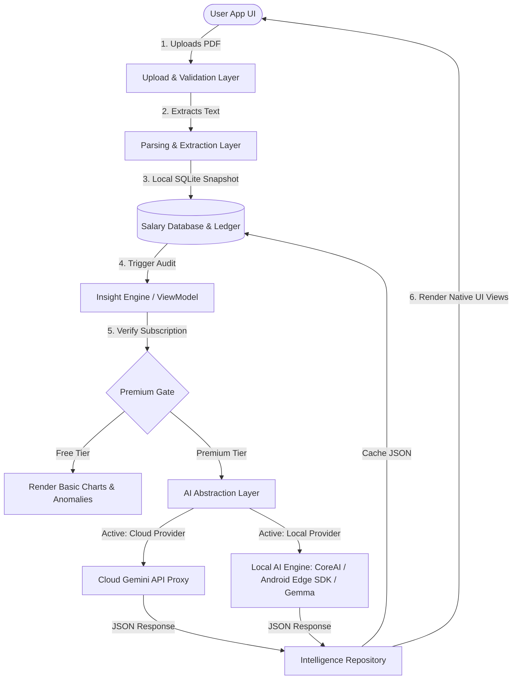

# AI Insights Architecture & Pipeline Documentation

This document serves as the master architectural reference for PayslipMax's **AI Insights Pipeline**. 

PayslipMax is an offline-first military payslip intelligence platform designed for Indian Army officers. It extracts structured salary data from monthly PCDA(O) PDF payslips and turns it into wealth optimization suggestions (tax planning, DSOP optimization) and error detection alerts (missing allowances, deduction spikes). AI-driven auditing is offered as a premium subscription tier.

Due to strict modularity guidelines, this documentation is partitioned into specialized, self-contained modules.

---

## Technical Index

1. **[01. User Journey & Sequence Diagrams](file:///Users/test/Downloads/PDFParser/docs/pipeline/01_user_journey.md)**
   - High-level user flow from PDF upload to local database storage, premium gating, and insight delivery.
2. **[02. Data Pipeline & Schema Design](file:///Users/test/Downloads/PDFParser/docs/pipeline/02_data_pipeline.md)**
   - Validation, duplicate check, OCR fallbacks, normalization, and database schemas.
3. **[03. AI Pipeline & Context Strategy](file:///Users/test/Downloads/PDFParser/docs/pipeline/03_ai_pipeline.md)**
   - Gemini proxy cloud flow, prompt assembly, and a cost/value evaluation of historical payslip context.
4. **[04. AI Provider Abstraction Layer](file:///Users/test/Downloads/PDFParser/docs/pipeline/04_ai_abstraction.md)**
   - Contract design for local on-device migrations (Core AI, Android Edge SDK, Gemma, Mistral, Llama).
5. **[05. Premium Feature Architecture](file:///Users/test/Downloads/PDFParser/docs/pipeline/05_premium_architecture.md)**
   - Monetization model, free vs. premium feature matrix, gating decorators, and secure verification flows.
6. **[06. Accrued Intelligence, Moats & Roadmap](file:///Users/test/Downloads/PDFParser/docs/pipeline/06_moat_and_scalability.md)**
   - Five-year intelligence compounding timeline, defensive moats, and the phased cloud-to-local scalability roadmap.

---

## Recommended Final Architecture

The combined current-state (Cloud Proxy) and future-state (Local Provider) architecture operates on a decoupled provider-agnostic design:

This master architecture ensures that the presentation layer (UI) and core business logic (Insight Engine) are completely shielded from the underlying AI execution environment.
