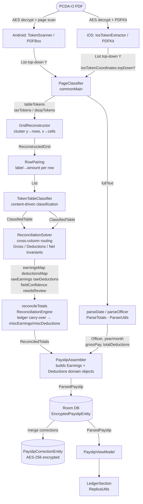
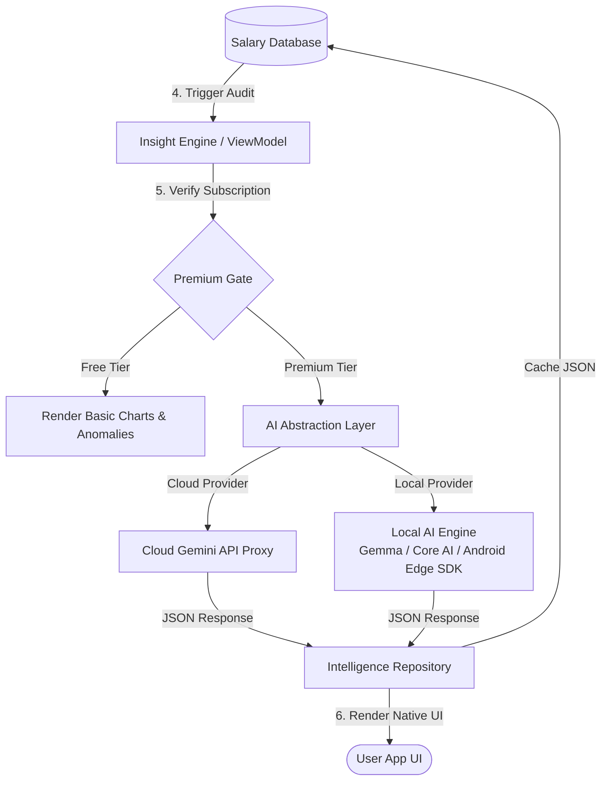

# PayslipMax — Parser & AI Insights Architecture

**One-stop reference for how the PCDA(O) payslip parser works, how AI Insights are generated, and how all the pieces connect. Updated to reflect the full Token-IR re-architecture (Phases 0–6) plus post-plan bugfixes.**

PayslipMax is an offline-first military payslip intelligence platform for Indian Army officers. It extracts structured salary data from monthly PCDA(O) PDF payslips and turns it into wealth-optimization suggestions and error-detection alerts. Everything described in this document runs on-device with no data leaving the device except for optional cloud AI inference.

---

## Table of Contents

1. [PDF → ParsedPayslip: Token-IR Pipeline](#1-pdf--parsedpayslip-token-ir-pipeline)
2. [Stage-by-Stage: Engine Reference](#2-stage-by-stage-engine-reference)
3. [Display Layer: Raw Path vs Structured Path](#3-display-layer-raw-path-vs-structured-path)
4. [Confidence Scoring & Per-Field Correction UI](#4-confidence-scoring--per-field-correction-ui)
5. [Corpus Regression Safety Net](#5-corpus-regression-safety-net)
6. [Legacy String Path (Tests / Secondary)](#6-legacy-string-path-tests--secondary)
7. [Security & PII Controls](#7-security--pii-controls)
8. [AI Insights Pipeline](#8-ai-insights-pipeline)
9. [Key File Reference](#9-key-file-reference)

---

## 1. PDF → ParsedPayslip: Token-IR Pipeline

### High-Level Data Flow



### What Changed from the Old Parser

| Old (string path)                               | New (token-IR, primary since Phase 4)                              |
|-------------------------------------------------|--------------------------------------------------------------------|
| Platform crops PDF into `leftColumnText` / `middleColumnText` using guessed `xSplit` geometry | Both platforms emit `List<PositionedToken>` — un-cropped, word-level, top-down Y |
| `splitCreditDebitSections()` tries to find the column boundary in text | `GridReconstructor` **learns** the credit and debit label x-bands per document from cleanly-matched keywords |
| `DynamicSpatialParser.applyHistoricalOverrides(year, month, …)` hardcodes per-month fudge factors | Deleted. Any residual is absorbed into `miscEarnings`/`miscDeductions` and recorded as a confidence signal |
| `reconciliation throws away the whole parse` on mismatch ≥ ₹2 | `netResidual` → `fieldConfidence` → `needsReview` — the parse is kept and surfaced for user review |
| iOS and Android diverge per-month (different crop geometry) | Both platforms follow the same `PositionedToken` contract; coordinate normalization in `IosTokenCoordinates.topDownY` |

---

## 2. Stage-by-Stage: Engine Reference

### Stage 1 — Platform Token Extraction

| Platform | Entry point | Library | Notes |
|----------|-------------|---------|-------|
| Android | `AndroidTokenExtractor.extractTokenized()` | PDFBox `PDFTextStripper` via `TokenScanner` | PDFBox Y is already top-down — no inversion needed |
| iOS | `IosTokenExtractor.extractTokenized()` | PDFKit `PDFPage.string(for:)` | `IosTokenCoordinates.topDownY(y, h, pageHeight)` inverts PDFKit's bottom-up Y |

Both produce `TokenizedPayslip(tableTokens, taxTokens, dsopTokens, fullText)`. `PageClassifier` (commonMain SSOT) classifies each page by keyword into table / tax / DSOP buckets — no per-platform divergence.

`PositionedToken` fields: `text`, `x`, `y` (top-down), `width`, `height`. Derived: `centerX`, `centerY`, `right`, `bottom`.

### Stage 2 — Grid Reconstruction (`GridReconstructor`)

Clusters tokens into a 2D grid per-document:

- **Row tolerance** = `max(3, medianHeight × 0.5)` — tokens within this vertical distance share a row.
- **Cell gap** = `max(3, medianHeight × 1.2)` — tokens separated by more than this horizontal distance are distinct cells; merged otherwise.

No hardcoded pixel values. Translation-invariant: shifting the whole table 120 px produces identical rows.

**Key pathology** (Bug 1 — Feb 2025): When the credit-total amount token sits < cellGap from an adjacent Hindi label token, they merge into one cell. E.g. `"271739 kuula kTaOtI"` gets paired with amount `109310`. Fixed in `TokenTableClassifier.toCandidate()` — see Stage 3.

### Stage 3 — Row Pairing (`RowPairing`)

Within each reconstructed row, pairs the leftmost text cell (label) to the rightmost numeric cell (amount) using an overwrite-pending heuristic. `parseAmount()` rejects dates (`01/2024`), trailing dots (`1.`), and currency prefixes (`Rs.1,39,604`).

### Stage 4 — Token Table Classification (`TokenTableClassifier`)

Content-driven classifier — never geometry-hardcoded:

1. **Match** each label against `PayslipPatternConfig.creditKeysMapping` / `debitKeysMapping` (SSOT — reuse, never copy).
2. **Learn** this document's credit-label and debit-label x-bands as the **median** x of cleanly-matched labels.
3. **Assign** ambiguous / unmatched labels by proximity to learned bands; labels farther than `acceptRadius = |debitBand − creditBand| / 2` are dropped (catches the "Details of Transactions" column).

`toCandidate()` guards:
- `normalized.isBlank()` → null (pure whitespace after Hindi negation)
- `normalized.none { it.isLetter() }` → null (**Bug 1 fix**: drops pseudo-labels like `"271739"` that are digit-only after Hindi words are removed)
- `normalized in normalizedBlocklist` → null

`negateHindiTransliterations()` (word-boundary regex, `IGNORE_CASE`) strips Hindi transliteration tokens (`kuula`, `Aaya`, `kTaOtI`, etc.) before classification.

Output: `ClassifiedTable` → `credits: List<ClassifiedEntry>` + `debits: List<ClassifiedEntry>` + `rawCredits()` / `rawDeductions()`.

### Stage 5 — Reconciliation Solver (`ReconciliationSolver`)

Routes each `ClassifiedEntry` into the right map using three rules:

| Entry | Route |
|-------|-------|
| Matched key, correct column | `earningsMap[standardKey]` / `deductionsMap[standardKey]` |
| Debit key stranded in credit column (ledger carry key) | `deductionsMap[matchedKey]` (ledger entry) |
| Debit key stranded in credit column (credit reversal key) | `earningsMap["adjPayAndAllce"]` |
| Credit key stranded in debit column | `deductionsMap[recoveryTargetFor(matchedKey)]` (recovery) |
| Unmatched | `rawEarnings[rawLabel]` / `rawDeductions[rawLabel]` |

Cross-column key-sets (`ledgerDebitKeys`, `creditReversalDebitKeys`, `recoveryTargetFor`) are SSOT in `PayslipPatternConfig`.

### Stage 6 — Reconciliation Engine (`reconcileTotals` in `ReconciliationEngine`)

1. **Ledger carry-over extraction**: removes `openingCreditBalance`, `closingDebitBalance`, etc. from the maps into `LedgerCarryOver` (with fullText fallback regex).
2. **True totals**: `trueGross = realGross − openingCr − closingDr`; `trueDeductions = realDeductions − openingDr − closingCr`.
3. **Misc residuals**: `miscEarnings = trueGross − sumEarnings` (if positive); `miscDeductions = trueDeductions − sumDeductions` (if positive). A large residual means items were missed; a negative residual (parsed sum > true total) is logged as a warning.
4. **Net residual**: `|expectedNet − printedNet|`. ≥ ₹2 → logged + `needsReview = true`. No longer a hard failure.

> **Why "Gross Pay ≠ sum of displayed items" is often correct**: `realGross` from the PDF footer includes `openingCreditBalance` and `closingDebitBalance` (PCDA ledger carry-overs). After stripping these, `trueGross ≈ sumEarnings` and `miscEarnings ≈ 0`. The displayed items sum to `trueGross`, not `realGross`. This explains why some payslips show Gross Pay ₹3,37,772 but only ₹2,34,000 of credit rows — the difference is ledger balances, not missing items.

### Stage 7 — Confidence Scoring (`scoreConfidence`)

`sideConfidence = 1.0 − (misc / trueTotal)`. A side that reconciles cleanly (small misc) gives high confidence to all its line items. Raw/ambiguous items carry `× RAW_PENALTY (0.8)`. Populated into `ParsedPayslip.fieldConfidence: Map<String, Float>`.

### Stage 8 — Domain Assembly (`PayslipAssembler`)

Maps `earningsMap` → `Earnings` struct + `miscEarnings`, `deductionsMap` → `Deductions` struct + `miscDeductions`. `ParsedPayslip.rawEarnings` and `rawDeductions` hold unmatched items. Both are committed to the DB via `EncryptedPayslipEntity` (AES-256).

---

## 3. Display Layer: Raw Path vs Structured Path

`ReplicaUtils.getCreditsList(payslip)` and `getDebitsList(payslip)` select one of two display paths:

```
rawEarnings.isEmpty() → Structured Path
rawEarnings.nonEmpty() → Raw Path
```

### Structured Path (rawEarnings empty — all credits matched)

Returns explicit `LedgerLine` rows for every `Earnings` field with `amount ≠ 0.0`, including `LedgerLine("MISC", earnings.miscEarnings, …, "miscEarnings")` when `miscEarnings > 0`.

### Raw Path (rawEarnings non-empty — some credits unmatched)

Filters `rawEarnings` entries:

```kotlin
value != 0.0
    && (creditKeysMapping[key] ?: key) !in excluded  // skip ledger balance keys
    && isValidRawKey(key)                             // skip pure Hindi-word / digit-only keys (Bug 1 display guard)
```

Then appends a **MISC absorb row** (Bug 3 fix):

```kotlin
val rawMisc = payslip.summary.grossPay - items.sumOf { it.amount }
if (rawMisc > ConfidenceThresholds.ITEM_SUM_TOLERANCE) {
    items + LedgerLine("MISC", rawMisc, …, "miscEarnings")
}
```

This ensures the displayed item sum always reconciles to `grossPay` when items are under-extracted. The MISC row uses `"miscEarnings"` as `fieldKey` (same as structured path) for SSOT correction flow compatibility.

The same logic applies to the debit path with `totalDeductions` / `"miscDeductions"`.

### Mismatch Banner (phantom over-count)

```kotlin
internal fun creditsMismatch(payslip: ParsedPayslip): Double =
    getCreditsList(payslip).sumOf { it.amount } - payslip.summary.grossPay

internal fun debitsMismatch(payslip: ParsedPayslip): Double =
    getDebitsList(payslip).sumOf { it.amount } - payslip.summary.totalDeductions
```

After MISC absorb, `mismatch > 0` only when items **over-count** the printed total (phantom entry). `LedgerSection` passes both values to `LedgerTableFooter`. When either exceeds `ConfidenceThresholds.ITEM_SUM_TOLERANCE (= 2.0)`, `LedgerMismatchBanner` renders an `AppColors.Warning` chip showing the over-count amount.

**Tolerance SSOT**: `ConfidenceThresholds.ITEM_SUM_TOLERANCE` (shared domain object) is the single constant used by both the MISC absorb decision and the banner threshold.

### `isValidRawKey` — Display Guard (Bug 1 defense-in-depth)

```kotlin
private fun isValidRawKey(key: String): Boolean {
    val afterHindi = key.lowercase().split(Regex("\\s+"))
        .filterNot { it in hindiWordSet }.joinToString(" ").trim()
    return afterHindi.any { it.isLetter() }
}
```

Filters raw map entries whose keys are digit-only or Hindi-word-only after stripping. Defends against any stale DB records that bypassed the parser-layer fix.

---

## 4. Confidence Scoring & Per-Field Correction UI

### Confidence Flow

```
ReconciliationSolver.scoreConfidence()
    → ParsedPayslip.fieldConfidence: Map<String, Float>
    → ParsedPayslip.needsReview: Boolean

ConfidenceThresholds.REVIEW_THRESHOLD = 0.7f  (SSOT)
ParsedPayslip.isFieldLowConfidence(fieldKey)   (extension, ConfidenceThresholds.kt)
```

### Correction Persistence

`PayslipCorrectionEntity(dateStr PK, ciphertext)` stores AES-256-encrypted `Map<String, Double>` via `CryptoHelper`. DB schema v9 (auto-migration from v8). Corrections are:
- **Applied on read** via `combine` in `getAllPayslips()` / `getPayslipByDate()` → `applyCorrections(Map<fieldKey,Double>)`.
- **Never mutate the original parse** — stored separately so re-parsing (e.g. on engine improvement) can overwrite only the parsed side.

### UI Wiring

```
LedgerRowItem         → shows AppColors.Warning Info icon when isFieldLowConfidence(fieldKey)
LedgerCorrectionDialog → inline edit dialog (per-field)
PayslipReplicaScreen  → onCorrectField → PayslipViewModel.applyCorrection()
PayslipViewModel      → repository.saveCorrection(dateStr, fieldKey, newValue) + updates selectedPayslip
```

`LedgerLine.fieldKey` is the SSOT bridge between display and correction:
- Structured path: domain field name (e.g. `"basicPay"`, `"incomeTax"`)
- Raw path: raw PDF label (e.g. `"BONUS X"`, `"RH12"`)

---

## 5. Corpus Regression Safety Net

**Purpose**: makes "fix one month, break another" structurally impossible.

### Fixture Layout

```
shared/src/androidUnitTest/resources/corpus/
    <id>.json          ← scrubbed full-text / column texts (input)
    <id>.tokens.json   ← scrubbed positioned tokens (input)
    ground_truth.json  ← human-verified ParsedPayslip JSON (expected output)
```

52 fixtures covering 2022–2026. De-identified by `CorpusScrubber`:
- Name → `Officer Officer Officer`
- Account → `16/000/000000X`
- PAN → `AR*****90G`
- Email → scrubbed
- Numbers untouched

### Always-On Tests

| Test | Scope | What it checks |
|------|-------|----------------|
| `PayslipCorpusRegressionTest` | androidUnitTest | Text-path `PayslipTextParser.parse` vs ground truth for all 52 fixtures |
| `TokenParseCorpusRegressionTest` | androidUnitTest | Token-path `PayslipTokenParser.parse` vs ground truth (primary path) |
| `TokenCorpusRegressionTest` | androidUnitTest | Token fixture well-formedness (52 `.tokens.json` files) |
| `TokenTableEngineTest` | commonTest | Synthetic token layout tests, incl. translation-invariance + Bug 1 regression |
| `ReplicaUtilsMismatchTest` | commonTest | MISC row appearance, creditsMismatch/debitsMismatch helpers |

### Opt-In Local Tests (never in CI)

`-Dpayslip.localCorpus=<path>` → `CorpusCaptureTest` runs the real pipeline over PDFs at `~/Desktop/Pay Slip Elements`, writes scrubbed fixtures. Gated; no PII ever committed.

---

## 6. Legacy String Path (Tests / Secondary)

`PayslipTextParser` + `DynamicSpatialParser` + `ParserUtils.splitCreditDebitSections` remain in the codebase as the **secondary** path. They are:
- Off the production parse path (both Android and iOS now call `PayslipTokenParser` via the token path).
- Backed by the `PayslipCorpusRegressionTest` text-fixture regression suite (ensures the old path remains stable for comparison).
- Used by the opt-in `CorpusCaptureTest` capture utility.

Removing the string path entirely requires migrating those tests to the token path — deferred as a clean-up task.

**Deleted in Phase 4:**
- `DynamicSpatialParser.applyHistoricalOverrides()` — per-month fudge factors gone.
- iOS string crop (`IosLayoutScanner.kt`, `extractTextSpatially`) — 134 lines deleted.
- Hard-fail `Result.failure` reconciliation — replaced by `netResidual` + `needsReview`.

---

## 7. Security & PII Controls

| Control | Implementation |
|---------|----------------|
| Payslip data at rest | AES-256 via `CryptoHelper` (Android Keystore / iOS Keychain) → `EncryptedPayslipEntity` |
| Corrections at rest | Same `CryptoHelper` → `PayslipCorrectionEntity` (DB v9) |
| Auto-Backup disabled | `allowBackup="false"` in AndroidManifest — prevents restoring DB without hardware-bound key |
| Self-healing decryption | Falls back to legacy key on `BAD_DECRYPT`; clears corrupt data rather than bricking |
| Committed fixtures | `CorpusScrubber` strips all PII before commit; only `AR*****90G` / `16/000/000000X` placeholders remain |
| PDF password | Removed hardcoded default from UI (`UploadWidget`, `SettingsScreen`) — field starts empty |
| Opt-in capture | System-property-gated (`-Dpayslip.localCorpus`); never writes real PII to committed resources |
| PII in git history | Real name/account remained in history pre-Phase 6. Destructive `filter-repo`/BFG rewrite deferred (user decision required) |

---

## 8. AI Insights Pipeline

AI Insights layer sits above `ParsedPayslip` — it consumes already-parsed, already-stored payslip data.



### Deterministic Rules Engine

`DeterministicIntelligenceEngine` orchestrates specialized `RuleAuditor` implementations:

| Auditor | What it checks |
|---------|---------------|
| `DaArrearsAuditor` | Mathematical DA adjustment progression |
| `MarriedQuartersRiskAuditor` | Retroactive rent recovery risk |
| `UnexpectedDebitAuditor` | Abnormal ledger recovery spikes |
| `DsopComplianceAuditor` | 6% statutory minimum savings; ₹41,666/mo tax threshold |
| `TaxProjectionAuditor` | Annual ITAX trajectory from YTD |
| `SalaryLossAuditor` | Unexplained net-pay drops |
| `MissingAllowanceAuditor` | Allowances present in past but absent this month |
| `TptaEntitlementAuditor` | Transport allowance entitlement vs received |

`InsightPrioritizationEngine` scores alerts on 5 dimensions, filters below 7.0, caps dashboard at top 4, uses ₹ value as tie-breaker.

### AI Provider Abstraction

`AIInsightProvider` interface isolates business logic from model execution:
- `GeminiCloudProvider` — cloud inference (active).
- `LocalGemmaProvider` — on-device (placeholder → upgraded to dynamic `AiInsightReport` JSON construction).
- `AIProviderManager` — selects provider; toggleable via Settings (`useLocalAi` preference, DB schema v7).

---

## 9. Key File Reference

### Parser Core (shared/commonMain)

| File | Role |
|------|------|
| `parser/PositionedToken.kt` | Token IR data class (text, x, y, width, height + derived helpers) |
| `parser/PageClassifier.kt` | SSOT page-type detection (table / tax / DSOP) by keyword |
| `parser/GridReconstructor.kt` | Clusters tokens → 2D grid; tolerances derived from median height |
| `parser/RowPairing.kt` | Row-local label→amount pairing; `parseAmount()` rejection rules |
| `parser/TokenTableClassifier.kt` | Content-driven credit/debit classification; learns x-bands per document |
| `parser/ReconciliationSolver.kt` | Cross-column routing; confidence scoring; `needsReview` flag |
| `parser/ReconciliationEngine.kt` | Ledger carry-over extraction; `miscEarnings`/`miscDeductions` computation |
| `parser/PayslipAssembler.kt` | `earningsMap` + `miscEarnings` → `Earnings` domain object; final `ParsedPayslip` construction |
| `parser/PayslipTokenParser.kt` | Primary parse entry point: tokens → `ParsedPayslip` |
| `parser/PayslipPatternConfig.kt` | SSOT: `creditKeysMapping`, `debitKeysMapping`, `blocklist`, `hindiTransliterations`, cross-column routing sets |
| `parser/ParserUtils.kt` | `negateHindiTransliterations()`, `parseTotals()`, `parseOfficer()`, `splitCreditDebitSections()` (legacy) |
| `domain/ConfidenceThresholds.kt` | SSOT: `REVIEW_THRESHOLD = 0.7f`, `ITEM_SUM_TOLERANCE = 2.0` |
| `domain/Model.kt` | `ParsedPayslip`, `Earnings`, `Deductions`, `PayslipSummary`, `LedgerBalances` |

### Platform Adapters

| File | Role |
|------|------|
| `androidMain/.../parser/TokenScanner.kt` | PDFBox `PDFTextStripper` → word-level `PositionedToken` list |
| `androidMain/.../parser/AndroidTokenExtractor.kt` | Page classification + scan via `TokenScanner` |
| `iosMain/.../parser/IosTokenExtractor.kt` | PDFKit page scan; delegates Y-inversion to `IosTokenCoordinates` |
| `iosMain/.../parser/SpatialTextExtractor.kt` | `IosTokenCoordinates.topDownY(y, h, pageHeight)` Y normalization |

### Display Layer (composeApp/commonMain)

| File | Role |
|------|------|
| `ui/screens/ReplicaUtils.kt` | `getCreditsList`, `getDebitsList` (raw/structured path selection); MISC absorb row; `creditsMismatch`, `debitsMismatch` helpers; `isValidRawKey` display guard |
| `ui/screens/LedgerSection.kt` | `LedgerSection` composable; `LedgerTableFooter`; `LedgerMismatchBanner` (phantom over-count warning) |
| `ui/screens/LedgerCorrectionDialog.kt` | Per-field inline correction dialog |
| `ui/theme/ConfidenceThresholds.kt` | (see shared domain above — imported by composeApp) |
| `ui/theme/AppStrings.kt` | All UI strings (no hardcoded strings anywhere in the UI) |
| `ui/theme/Theme.kt` | `AppColors`, `AppDimensions` |

### Corpus & Tests

| File | Role |
|------|------|
| `androidUnitTest/.../PayslipCorpusRegressionTest.kt` | Always-on text-path regression (52 fixtures) |
| `androidUnitTest/.../TokenParseCorpusRegressionTest.kt` | Always-on token-path regression (52 fixtures, primary path) |
| `androidUnitTest/.../TokenCorpusRegressionTest.kt` | Token fixture well-formedness check |
| `androidUnitTest/.../CorpusCaptureTest.kt` | Opt-in capture utility (`-Dpayslip.localCorpus`) |
| `commonTest/.../TokenTableEngineTest.kt` | Synthetic token layout tests + translation-invariance + Bug 1 regression |
| `commonTest/.../ReplicaUtilsMismatchTest.kt` | MISC row + mismatch helper unit tests |

---

## Post-Plan Bugfixes

### Bug 1 — Phantom "uula" Deduction (Feb 2025)

**Root cause**: In Feb 2025's PDF layout, the credit-total amount token (`"271739"`) sits 4 px from the adjacent Hindi label (`"kuula kTaOtI"`). Since 4 px < `cellGap` (7.2 px), `GridReconstructor` merges them into one cell: `"271739 kuula kTaOtI"`. After `negateHindiTransliterations`, the label becomes `"271739"` — not blank, not in blocklist → passes toCandidate → gets booked as a debit raw entry with amount 109310 (the actual total deductions, displayed as a phantom line item).

**Fix (two-layer)**:
1. Parser (`TokenTableClassifier.toCandidate`): `if (normalized.none { it.isLetter() }) return null` — drops digit-only pseudo-labels.
2. Display (`ReplicaUtils.isValidRawKey`): filters any stale DB keys that are digit-only/Hindi-word-only after negation.

Commit: `4468b5b`. Regression test: `TokenTableEngineTest.hindiTotalsMergedWithAmountDropped`.

### Bug 3 — Item Sum vs Footer Total Verification

**Root cause**: The display layer showed raw items without accounting for the gap between item sums and printed footer totals. Under-extraction meant some credits/debits were invisible; phantom entries couldn't be flagged.

**Fix (Option C)**:
1. **MISC absorb row**: raw path appends a MISC row for `(printedTotal − itemSum)` when the difference exceeds `ITEM_SUM_TOLERANCE`. Turns invisible residuals into a visible, labeled row.
2. **Mismatch banner**: after MISC absorb, any remaining positive mismatch (items > printed total = phantom entry) fires an `AppColors.Warning` banner in `LedgerTableFooter` with the over-count amount.

Commit: `b33f034`. Tests: `ReplicaUtilsMismatchTest` (9 cases).
