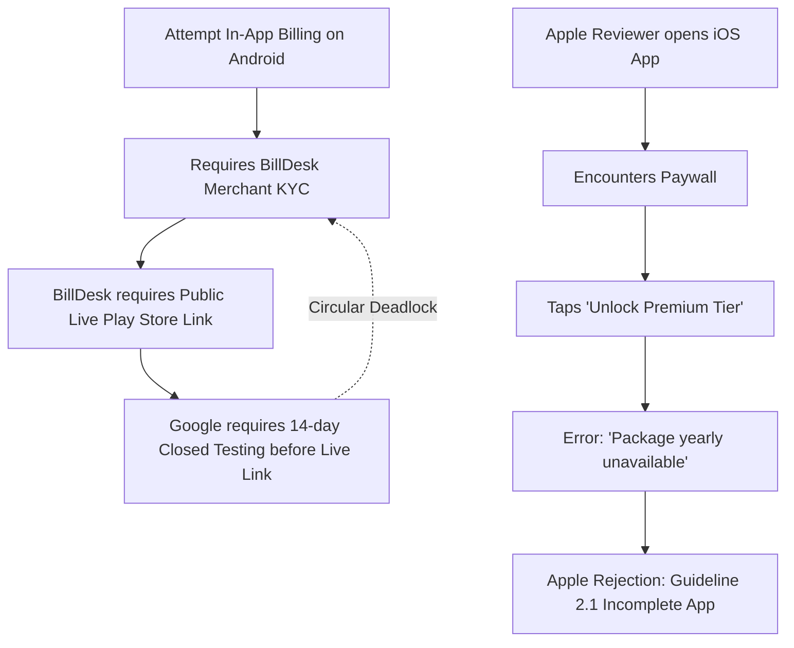

# ⚠️ ARCHIVED — Launch Strategy & Monetization Unblocking (v1.0 to v1.1)

**Date**: September 7, 2026 (archived 2026-09-15)  
**Document**: Historical strategy record; execution has moved to active logs below.

> This document is a pre-execution strategy sketch. For current status and execution logs, see:
> - **[06_closed_testing_progress_log.md](06_closed_testing_progress_log.md)** — Android detailed execution log
> - **[07_platform_monetization_rollout.md](07_platform_monetization_rollout.md)** — Current platform-independent status
> - **[08_ios_monetization_phaseplan.md](08_ios_monetization_phaseplan.md)** — iOS phase-by-phase execution (complete through Phase 9)

---

## Original Strategy (archived below)  

---

## 0. Review Notes (2026-09-07) — read before executing the checklist

An expert review of this plan (industry research + codebase check) confirmed the overall two-phase
strategy but corrected/refined a few points. Keep this section updated as the guiding reference for
future paywall strategy — don't just tick boxes below without re-reading this.

- **Android's free-first launch is not optional** — it's forced by Google Play policy (closed
  testing hides the public URL BillDesk requires), not by anything in our code. No way to route
  around it.
- **Correction**: checklist item 2.2 originally said "20 active opted-in testers." Google reduced
  this to **12 testers / 14 days** on 2024-12-11 ([Play Console Help](https://support.google.com/googleplay/android-developer/answer/14151465?hl=en)).
  Recruit 12, not 20.
- **Correction**: BillDesk/PA-CB isn't limited to cross-border sales — Google's rollout requires
  **any** new merchant account selling in India (domestic included) to verify through BillDesk from
  2026-01-01. There's no "stay domestic-only" escape hatch.
- **iOS does *not* need the free-unlock as a technical fix** — the Guideline 2.1 rejection is a real
  RevenueCat/StoreKit misconfiguration (no Apple app added, no product attached), not a
  review-environment issue. Unlocking the paywall avoids exercising the broken path rather than
  fixing it. The direct fix (Section 4: add Apple app in RevenueCat, create the IAP in App Store
  Connect, attach the product, drop in the `appl_...` key) is dashboard/console config with **no
  waiting period** — do it in parallel with the Android free-launch track, don't treat it as
  gated by the same 14-day clock.
- **Why we're still shipping iOS free in v1.0 anyway**: brand/version parity (both platforms hit
  v1.0 together) plus a deliberate GTM choice — launch free to build an install base and reviews,
  monetize once there's traction, which is a standard freemium pattern. Since there are **no real
  users yet**, there's no bait-and-switch cost to worry about when the paywall reappears in v1.1.
  Re-evaluate this reasoning if real installs accumulate before v1.1 ships — gating previously-free
  features out from under an existing user base is a known trigger for review-bombing/refund
  requests, and at that point a grandfather clause for v1.0 installs should be considered.
- **Apple's own accepted alternative** to a full unlock, for future reference: a demo/sandbox
  account with an expired subscription noted in App Review Information. Doesn't apply here since
  the backend is actually broken, but worth knowing for any *future* 2.1 rejection that isn't a
  real config bug.
- **2026-09-10 decision — split v1.1 into two separate releases, don't bundle Step 4 and Step 5.**
  Originally Section 6 said "ship Step 5 alongside Step 4 in the same v1.1 release." Superseded:
  - **Release 1 (v1.1, "ODR polish")**: Gemma-on-iOS via On-Demand Resources only (Step 5, now
    functionally complete per the updated section below). `FREE_LAUNCH_MODE` stays `true`. Low
    risk, already verified end-to-end on device except the offline→Retry resume path.
  - **Release 2 (v1.2, "monetization")**: Step 4 (RevenueCat + StoreKit paywall re-enable) on its
    own, once fully verified in TestFlight sandbox.
  - **Why**: Step 4 touches the exact RevenueCat/StoreKit surface that caused the original v1.0.0(2)
    Guideline 2.1 rejection. Bundling it with the already-low-risk ODR work means a Step 4 bounce
    (subscription review, sandbox purchase-flow bug, etc.) would hold back or re-risk the ODR fix
    too. Decoupling lets Release 1 ship as soon as it's ready, independent of Apple's subscription
    review turnaround and sandbox purchase-flow testing for Release 2.
  - Rough estimate at time of decision: Release 1 ~2–4 days (retry re-test + TestFlight + App
    Review), Release 2 ~5–8 days after that (gated mostly by Apple's own subscription review and
    sandbox purchase-flow verification, not dev time). Directional only — Apple doesn't publish
    SLAs.

### Implementation status

- [x] **Phase 1 code change**: `LaunchFlags.FREE_LAUNCH_MODE` (shared, commonMain,
      `subscription/LaunchFlags.kt`) added as the single toggle for the v1.0 free-launch strategy.
      Wired into `SubscriptionManager.hasAccess()` below the debug `DevOverride` (so QA can still
      use `FORCE_FREE` to test locked UX) and above billing state (so it grants access regardless
      of RevenueCat/flag state). Unit-tested (`SubscriptionManagerTest`): grants every `FeatureGate`
      in release with no billing manager and `isPremiumEnabled=false`; confirms debug `FORCE_FREE`
      still blocks even when free-launch mode is on.
- [x] **Follow-up fix — dangling paywall UI**: unlocking `hasAccess()` alone was **not** sufficient.
      Two UI surfaces reference the raw `uiState.isPremiumEnabled` settings flag (always `false`
      pre-purchase) or a hardcoded badge directly, independent of the gate:
      - The Settings screen's "Upgrade to PayslipMax Premium" card/row
        (`AccountSubscriptionSection`/`PremiumSection` in `SettingsSectionComponents.kt`) still
        opened the upgrade sheet → "Unlock Premium Tier" → `launchPurchaseFlow()` → the exact same
        broken RevenueCat/StoreKit call that got iOS rejected under 2.1 in the first place. Fixed by
        hiding that card/row entirely behind `!LaunchFlags.FREE_LAUNCH_MODE`.
      - The Backup & Restore settings row (`BackupRestoreSettingsCard.kt`) showed a hardcoded
        "PREMIUM" badge regardless of actual access — contradicting its own "Configured" subtitle
        once `canBackup` was true. Fixed to only show the badge when `!canBackup`.
      - The Premium Features catalog screen (`PremiumFeaturesScreen.kt`) was left as-is: its
        `rowMode()` already derives locked/unlocked state from `hasAccess()` per row, so with every
        gate open it naturally renders everything as included/openable and never reaches the
        upgrade sheet — no separate fix needed there.
      - **Lesson for next time**: any UI element that gates on entitlement must key off
        `SubscriptionManager.hasAccess()` (or a value that flows from it), never off the raw
        `isPremiumEnabled` settings flag or a hardcoded badge — the latter two don't see
        `LaunchFlags.FREE_LAUNCH_MODE` and will silently reintroduce a dead-end purchase flow.
- [x] **Recovery note (2026-09-07, later same day)**: this Phase 1 work was accidentally discarded
      from the working tree before being committed, then recovered from dangling git blobs and
      re-committed (`542eb0c`). Also added an injectable `isFreeLaunchModeProvider` to
      `PayslipViewModel` so pre-existing subscription/billing tests can pin launch-mode off to test
      premium-flag/billing gating logic in isolation — see the 5 test fixes in that commit.
- [ ] Flip `LaunchFlags.FREE_LAUNCH_MODE` to `false` once Section 4 (RevenueCat + StoreKit config,
      both platforms) is complete and verified in TestFlight/internal testing, to re-enable the
      real paywall for v1.1 — and re-check the two UI surfaces above still make sense once that
      happens (the hidden card/row should simply reappear; no further code change expected).

### Full audit — every purchase-sheet entry point, and why each is safe

All 4 places in the app that can open the purchase sheet (`launchPurchaseFlow`) were checked. Every
one resolves to `LaunchFlags.FREE_LAUNCH_MODE` as the single point of control — either directly, or
transitively through `SubscriptionManager.hasAccess()`:

| Screen | Trigger condition | Neutralized by |
|---|---|---|
| `SettingsSectionComponents.kt` (Upgrade card/row) | always visible pre-fix | direct: `if (!LaunchFlags.FREE_LAUNCH_MODE)` wrap |
| `PremiumFeaturesScreen.kt` | row `mode == LOCKED` | indirect: `rowMode()` derives from `hasAccess(gate)` per row |
| `InsightsScreen.kt` | `access.hasXxx == false` (`rememberInsightsFeatureAccess`) | indirect: wraps `hasAccess(gate)` per gate |
| `RepresentationScreen.kt` | `!hasClaimGenerator` | indirect: `hasClaimGenerator = rememberHasAccess(FeatureGate.CLAIM_GENERATOR)` |

Plus the Backup & Restore `PREMIUM` badge (`BackupRestoreSettingsCard.kt`), now `if (canBackup) null
else AppStrings.premiumBadgeTag` — `canBackup` is itself `hasAccess`-derived.

**Resurrection is one line.** Flip `FREE_LAUNCH_MODE` from `true` to `false` in `LaunchFlags.kt`:
every gate re-locks via `hasAccess()`, and every hidden upgrade CTA reappears automatically. No other
file needs to change.

**Rule for any new gated UI added before v1.1**: it must read `hasAccess(gate)` (or a value derived
from it) to decide whether to show a lock/upgrade CTA. Never gate on the raw `isPremiumEnabled`
settings flag or a hardcoded badge/string — those don't see `LaunchFlags` and will silently
reintroduce a dead-end purchase button during free launch.

### Cosmetic follow-up — "Premium Features" copy

Not a rejection risk (no purchase CTA left on that screen — see audit above), but "Premium
Features" / "Everything included with PayslipMax Premium" reads oddly on a free app. Swapped to
launch-neutral copy, same one-flag pattern as the rest of this plan:

- `AppStringsPremium.kt` — added `premiumCatalogTitleDisplay`, `premiumCatalogSubtitleDisplay`,
  `premiumCatalogSettingsEntrySubtitleDisplay` (computed `val`s, not `const val`, since they branch
  on `LaunchFlags.FREE_LAUNCH_MODE` at read time). `true` → "Everything Included" / "All features
  are unlocked for launch" / "See everything included". `false` → the original
  "Premium Features" / "Everything included with PayslipMax Premium" / "See everything Premium
  unlocks" strings, untouched.
- The 2 Settings entry points (`AccountSubscriptionSection`/`PremiumSection` in
  `SettingsSectionComponents.kt`) were switched to the `*Display` variants.
- `PremiumFeaturesScreen.kt`'s own header still reads the static `premiumCatalogTitle`/
  `premiumCatalogSubtitle` (i.e. "Premium Features" / "Everything included with PayslipMax
  Premium") — **not yet swapped to the `*Display` variants**. Low priority (same non-rejection-risk
  reasoning as above), but worth doing before wide release for copy consistency.
- Reverts automatically with the same `FREE_LAUNCH_MODE` flip — no separate copy change needed for
  v1.1.

---

## 1. Executive Summary & Current State

### Android (Google Play Console)
- **Status (updated 2026-09-24):** the circular deadlock described below is resolved. Closed testing's
  14-day window completed, Google granted production access, and versionCode 15 (1.0.0) was submitted
  to the **production** track (100% rollout, `FREE_LAUNCH_MODE` still on) and is now **live on Google
  Play** (confirmed by the owner 2026-09-24). See
  [06_closed_testing_progress_log.md](06_closed_testing_progress_log.md)'s "PROMOTED TO PRODUCTION"
  section for the full record. The BillDesk merchant-KYC blocker below is now actionable:
  the Play Store URL is live, so doc 07 §4 step 5 (submit the live URL to BillDesk) is the **next
  action**, not a new Play-side blocker.
- **Original blocker (historical, now resolved):** Day 1 of mandatory 14-day Closed Testing track;
  Google Play Payments Profile required mandatory RBI/PA-CB Merchant Identity Verification handled via
  **BillDesk**, which in turn required a live public Play Store URL that didn't exist yet while in
  Closed Testing (`play.google.com/apps/testing/...`, restricted to authorized testers, 404s for
  BillDesk review officers).

### iOS (Apple App Store Connect)
- **Status**: App version 1.0 (Build 2) **Rejected**.
- **Guideline**: `2.1.0 Performance: App Completeness`.
- **Reason**: Apple reviewers tapped **"Unlock Premium Tier"** on the paywall screen and encountered an inline red error:
  > *"Purchase failed: Package yearly unavailable"*
- Because core features (DSOP Simulator, Tax Planner, Wealth Optimization, Anomaly Detection) are gated behind this paywall, the reviewer was unable to test or verify the app's functionality and flagged the submission as incomplete.

---

## 2. Problem Statement: The Circular Dependency Loop

We are facing two interconnected blockers across both platforms:



1. **Android Loop**: BillDesk demands a live public URL before granting merchant payout approval. Google Play forbids public launch before completing 14-day closed testing.
2. **iOS Loop**: Apple rejects the app because the paywall is failing due to missing StoreKit product linkages and an unconfigured RevenueCat Apple App key.

---

## 3. What This Sprint Revealed

1. **Root Cause of iOS Paywall Failure**:
   - In [`RevenueCatApiKey.ios.kt`](file:///Users/sunil/Downloads/PayslipMAX%20KMP/shared/src/iosMain/kotlin/com/payslipmax/pdfparser/billing/RevenueCatApiKey.ios.kt), the app was compiled with the Phase 0 sandbox test key:
     `"test_QOmayJNDtTWprZuKRLJcsQKOOjW"`.
   - In RevenueCat's **API keys** settings, only two keys exist:
     - `Test Store`
     - `PayslipMax (Play Store)` (Google)
   - **There is NO Apple App Store configuration or `appl_...` key in RevenueCat yet.**
   - The StoreKit product was not linked in RevenueCat, so `resolveYearlyPackage()` returned `null`, triggering *"Package yearly unavailable"*.

2. **Root Cause of BillDesk Deadlock on Android**:
   - Online developer community consensus (`r/androiddev` and Google Developer policies) confirms: **Closed testing opt-in URLs (`/apps/testing/`) will ALWAYS be rejected by BillDesk**.
   - **Crucial Rule**: Free apps **DO NOT** require merchant verification to launch. A merchant account is only required when the app actively transacts real money payouts.

---

## 4. RevenueCat Process & Current State

From our audit of the RevenueCat dashboard:
* **Active Projects**: `PayslipMax`
* **Configured Apps**:
  - `Test Store` (Used in initial development)
  - `PayslipMax (Play Store)` (`goog_vuzJYrsxBRVpGihxiXcJBXBnybi`)
* **Missing Components**:
  - **Apple App Store App**: Not added under RevenueCat > Project Settings > Apps.
  - **In-App Purchase Key / Shared Secret**: Not connected between App Store Connect and RevenueCat.
  - **Default Offering Mapping**: Offering does not yet have an active Apple StoreKit product attached to the `yearly` package.

---

## 5. The Way Ahead: Two-Phase Strategy

The most reliable, industry-proven path forward is **Deferred Monetization (Launch Free v1.0, Monetize in v1.1)**.

### Phase 1: Launch v1.0 as Fully Unlocked / Free
- **Immediate Outcome**:
  - **Bypasses Apple 2.1 Rejection**: Apple reviewers can thoroughly test and verify every single feature without any paywall blocking them.
  - **Unblocks Google Play**: Completes 14-day closed testing without billing friction, allowing promotion to Production as a Free app.
  - **Resolves BillDesk**: Once published on Google Play, we provide BillDesk with the live public URL (`https://play.google.com/store/apps/details?id=in.aiborne.payslipmax`), enabling seamless merchant KYC approval.

### Phase 2: Re-enable Subscriptions in v1.1
- Complete App Store Connect + Google Play Console product setups.
- Add Apple app to RevenueCat and obtain the production `appl_...` key.
- Enable the paywall via app update / remote switch once both merchant accounts are active.

---

## 6. Master Execution Checklist

Use this interactive checklist to track progress step-by-step.

### Step 1: Unblock iOS App Store (v1.0 Re-submission)
- [x] **1.1** Temporarily bypass paywall gate in code — implemented as `LaunchFlags.FREE_LAUNCH_MODE`
      (see Section 0), not a `SubscriptionState.isSubscribed` field (that field doesn't exist;
      `SubscriptionState` is a sealed class of `Active`/`Inactive`/`Unknown`).
- [x] **1.2** Verify on physical iPhone: App launches, payslip imports, and all features (DSOP, Tax Planner, Anomaly Detection) are fully interactive with no error popups.
- [x] **1.3** Record 1–2 minute screen recording on physical iPhone showcasing the complete working flow — https://youtube.com/shorts/_5M3oamzRWA?si=JZ8v4dswY8Y528NO.
- [x] **1.4** Upload video and reply to Apple in App Store Connect Resolution Center — demo video + App Review Information note included with the resubmission.
- [x] **1.5** Bump iOS build version to `1.0.0 (3)` and submit new build for review — submitted 2026-09-07, 12:03 PM. Submission ID `39485df1-9bdf-42a2-9286-2e33f0311fd1`.
- [x] **1.6** Receive Apple App Store Approval — **Approved**. App Store Connect shows "iOS App 1.0"
      (1.0.0 (3)) as Review Completed / Approved as of 2026-09-09. Publish timing to the public App
      Store is a separate decision from approval itself.
- [ ] **1.7** Release the approved build to the public App Store now, without waiting on Android's
      14-day closed-testing clock or on Step 4/Step 5 (RevenueCat, Gemma-on-iOS) — see the 2026-09-09
      recommendation below. Nothing regresses by releasing now: Tier 6 Gemma fallback is already
      non-functional on iOS today, and the paywall is already bypassed via `FREE_LAUNCH_MODE`, so a
      v1.1 update later doesn't require holding v1.0 back. Steps to verify/click before release:
  - [ ] Confirm App Store Connect "Version Release" setting for 1.0.0 (3) — set to **manual release**
        (not automatic-on-approval, not scheduled) so the release moment is deliberate.
  - [ ] Re-check App Review Information / Resolution Center thread shows no open follow-up questions
        from the reviewer post-approval.
  - [ ] Confirm Age Rating, screenshots, and App Privacy "nutrition label" answers in App Store
        Connect still match the shipped build (no drift since the 1.0.0 (2) rejection cycle).
  - [ ] Confirm the production RevenueCat/StoreKit non-config (Section 4 "Missing Components") is
        expected and accepted for v1.0 — i.e. no purchase surface is reachable, per the Section 0
        audit table, so shipping without Apple IAP configured is intentional, not an oversight.
  - [ ] Click **"Release This Version"** in App Store Connect.
  - [ ] Post-release: verify the public App Store listing (`apps.apple.com`) resolves and shows
        1.0.0 (3) within Apple's usual propagation window (~a few hours).
  - [ ] Once live, capture the public App Store URL for future cross-linking (marketing, README,
        BillDesk-style external verification if ever needed on iOS).

**Recommendation (2026-09-09):** release iOS v1.0 now rather than gating it on Step 4 (RevenueCat)
or Step 5 (Gemma-on-iOS) below. Both of those are real, untested, multi-step work (new Xcode target,
App Group entitlements, R2-hosted model file, App Store Connect subscription config) with no fixed
timeline, and gating an *already-approved* build on them just re-creates the kind of deadlock this
whole document exists to avoid. Track Step 4 and Step 5 as the two v1.1 workstreams instead.

### Step 2: Unblock Android Closed Testing (v1.0 Production Release)
- [x] **2.1** Deploy the v1.0 free unlocked build to Google Play Closed Testing track — released
      through versionCode 7 (2026-09-09, 10:13) and versionCode 8 with R8 keep-rule hardening
      (2026-09-09, 20:12; full detail in
      [06_closed_testing_progress_log.md](06_closed_testing_progress_log.md)).
- [x] **2.2** Maintain **12** active opted-in testers for the 14-day mandatory period (reduced from
      20 by Google on 2024-12-11 — see Section 0). 25/25 opted in via third-party tester panel as of
      the v8 upload. Day-14 window completed — confirmed by Google's own dashboard, not inferred:
      Play Console shows "Congratulations! Your app has been granted Google Play production access"
      as of 2026-09-24.
- [x] **2.3** Apply for Production access as a Free application upon completion of Day 14 — granted by
      Google automatically once the mandatory-testing window completed (no separate application step
      was needed); confirmed 2026-09-24 via the Play Console dashboard screenshot and independently via
      `fastlane android track_status`.
- [x] **2.4** Google Play Production Approval & Public Release. **Done 2026-09-24 (app live, confirmed by the owner).** History:
      versionCode 15 (1.0.0) promoted to the `production` track at 100% rollout
      (`fastlane android promote_release version_code:15 to:production from:alpha`), Submission 15
      shows **Status: In review** in Play Console's Publishing overview. The first-production-release review
      has since cleared. See
      [06_closed_testing_progress_log.md](06_closed_testing_progress_log.md) for the full record.

### Step 3: Clear BillDesk KYC Verification
- [ ] **3.1** **(next action)** Copy the live public Google Play URL: `https://play.google.com/store/apps/details?id=in.aiborne.payslipmax`.
- [ ] **3.2** Open BillDesk verification form / respond to `onboarding@billdesk.com`.
- [ ] **3.3** Submit live Play Store link along with PAN, bank account proof, and complete Video KYC.
- [ ] **3.4** Receive BillDesk Merchant Approval for Google Play Payments Profile.

### Step 4: Configure Full RevenueCat & StoreKit Pipeline (Release 2 / v1.2)
- [ ] **4.1** In App Store Connect > **Subscriptions**, create Auto-Renewable Subscription (`payslipmax_yearly_premium`), set ₹999/yr pricing, and attach review screenshot.
- [ ] **4.2** In App Store Connect > **Agreements, Tax, and Banking**, ensure Paid Applications Agreement is active.
- [ ] **4.3** In Google Play Console > **Monetize > Subscriptions**, create base plan and set to **Active**.
- [ ] **4.4** In RevenueCat Dashboard > **Apps**, add **Apple App Store** app and link App Store Connect API Key / Shared Secret.
- [ ] **4.5** In RevenueCat Dashboard > **Product Catalog**, attach Apple and Google product IDs to `premium` entitlement and `yearly` package.
- [ ] **4.6** Update [`RevenueCatApiKey.ios.kt`](file:///Users/sunil/Downloads/PayslipMAX%20KMP/shared/src/iosMain/kotlin/com/payslipmax/pdfparser/billing/RevenueCatApiKey.ios.kt) with the newly generated `appl_...` key.
- [ ] **4.7** Re-enable paywall gating and release v1.1 with monetization active across both platforms.

### Step 5: Wire Up Gemma-on-iOS via On-Demand Resources (Release 1 / v1.1)

Android already ships the real Tier 6 offline Gemma fallback via a Gradle-driven Play Asset Delivery
step (Section 7). iOS originally planned to use Apple's **Background Assets** framework for this, but
that was superseded by **On-Demand Resources (ODR)** instead — see `GemmaModelPaths.ios.kt`,
`GemmaBaseModelInstaller.ios.kt`, and `GemmaOnDemandResourceBridge.swift` (commit `9fa3347`), which
replaced the unfinished `GemmaBackgroundAssetsBridge.swift`. Unlike Background Assets (OS-scheduled,
autonomous), ODR is app-triggered — `IosGemmaBaseModelInstaller.install()` calls `installTrigger`,
which `GemmaOnDemandResourceBridge.beginFetch()` wires to `NSBundleResourceRequest`.

- [x] **5.1–5.6 (superseded)** — the R2-hosting/manifest/extension-target/App-Group/Info.plist plan
      below was for Background Assets and is no longer applicable. ODR instead relies on Xcode's
      built-in Resource Tags mechanism: `gemma-active.litertlm` is tagged `"GemmaModel"` in the
      target's Resource Tags panel with "On Demand" download policy, and `NSBundle.pathForResource`
      resolves it once fetched — no R2 hosting, custom manifest, extension target, or App Group
      needed. Each dev machine must place the gitignored model file at `iosApp/iosApp/` and apply the
      tag locally before building.
- [x] **5.6 (bridge wiring)** — `GemmaOnDemandResourceBridge.swift` forwards
      `NSBundleResourceRequest` progress/completion into
      `IosGemmaBaseModelInstaller.companion.progressReporter`/`completionReporter`. Verified
      end-to-end on a physical device: model downloads via ODR, loads from the resolved bundle path,
      Tier 6 inference runs on a real payslip. Offline degradation also verified: app works fine
      without Gemma when offline, shows a non-blocking "Offline AI Download Error" banner with Retry,
      never crashes/hangs.
- [ ] **5.7** Checksum pinning for the ODR-delivered file — **recommended: skip**. Apple's own binary
      signing/ODR integrity covers this differently than Android's manual SHA-256 pin (Section 7); ODR
      resources are served from Apple's CDN and validated as part of the signed app bundle's resource
      catalog, not a raw downloaded file the app must self-verify. Revisit only if evidence emerges of
      ODR resource tampering/corruption in the wild.
- [x] **5.8 (partial, skipped for this release)** Device-tested: fresh install → ODR fetch →
      `GemmaEngine.ios.kt` loads the model → Tier 6 fallback produces output — **done**. Offline "not
      yet downloaded" degradation — **done**. **Decision (2026-09-10): ship without verifying** whether
      tapping **Retry** on the offline-error banner actually resumes the ODR fetch after the device
      comes back online. Rationale: the fallback path itself (non-blocking banner, no crash/hang) is
      already verified — worst case if Retry is silently broken is a user must force-quit/relaunch to
      retry, a degraded-UX issue, not a crash or data-integrity one. Tracked as a fast-follow, not a
      release blocker. Blocked so far by an Xcode/lldb quirk (the debug session drops when toggling
      network, even over USB — modern Xcode tunnels debugging through RemoteXPC, which shares infra
      with the network stack) and by Console.app device log streaming proving unreliable in testing on
      2026-09-10 (empty even when actively streaming with no filter, after a confirmed fresh install).
      Planned re-test method (next release): reattach Xcode's debugger only *after* re-enabling network
      but *before* tapping Retry (the RemoteXPC drop only happens during the network toggle itself, not
      while stable), or inspect the device's app container directly (Xcode → Devices and Simulators →
      Download Container) to rule out a stale/partial debug-only sideloaded model file short-circuiting
      `resolveInstalledGemmaModelPath()` (`GemmaModelPaths.ios.kt`) before the ODR retry ever fires.
- [ ] **5.9** Document the release procedure here (mirroring Section 7's Android procedure) once
      finalized, so future iOS release builds have the same "what must be true before shipping" gate
      Android already has.

Ship Step 5 as its own release (**Release 1 / v1.1**), independent of Step 4 — see the 2026-09-10
decision in Section 0. `FREE_LAUNCH_MODE` stays `true` for this release; only the Gemma delivery
mechanism changes.

### 5.10 — v1.1.0 (3) submitted to App Review, 2026-09-10

- [x] **Discovered mid-submission**: the first upload attempt, `1.1.0 (2)`, failed App Store
      processing with **error 90557 "Thinned app size is too large"** — the `GemmaModel` ODR asset
      pack is 584MB, and Apple caps a single ODR asset pack at **512MB on iOS/iPadOS below 18**
      ([Apple's ODR size-limits doc](https://developer.apple.com/help/app-store-connect/reference/app-uploads/on-demand-resources-size-limits/)).
      The project's `Minimum Deployments` was iOS 16.0 at the time, so the stricter 512MB rule
      applied.
- [x] **Fix chosen: raise `Minimum Deployments` to iOS 18.6**, not shrink the model or revert to
      Background Assets. On iOS/iPadOS 18+, the same Apple doc raises the per-pack limit to 8GB,
      which the 584MB pack clears with room to spare — a one-line Xcode change vs. reviving the
      superseded Background Assets/R2-hosting architecture (Section 6, Step 5 intro) or requantizing
      the model. **Trade-off accepted knowingly**: this release drops support for iOS 16–18.5
      devices. Revisit if evidence emerges that a meaningful share of the install base sits below
      iOS 18.
- [x] **Apple's own guidance flagged for future reference**: the ODR size-limits doc notes ODR
      itself is deprecated as of iOS/iPadOS 27, with Apple recommending migration to **Background
      Assets** — the exact framework this project moved *away from* in favor of ODR (commit
      `9fa3347`). Not actionable now, but worth re-reading before any future iOS min-version bump
      that would re-trigger ODR size-limit tiers, and before the framework choice is revisited long
      term.
- [x] Also discovered and fixed during this pass: `Supported Destinations` had **Mac (Designed for
      iPhone)** and **Apple Vision (Designed for iPhone)** enabled by Xcode default (any iOS 16+
      target auto-qualifies for both compatibility modes) — removed both, since the ODR/Gemma path
      was never tested on those platforms. Left only **iPhone** as a supported destination.
- [x] Marketing Version bumped to `1.1.0`, Build to `3` (`1` and `2` were consumed by local/failed
      upload attempts and not reused, to avoid ambiguity with the rejected `1.1.0 (2)` upload record
      already in App Store Connect).
- [x] Rebuilt after a clean build folder (stale DerivedData had initially caused the new build
      number not to propagate into one archive) — `1.1.0 (3)` processed successfully in TestFlight.
- [x] New App Store version `1.1.0` created in App Store Connect (separate from the existing `1.0`
      version entry, which stays "Ready for Distribution" and untouched), build `1.1.0 (3)` attached,
      Version Release set to manual, and **submitted for App Review 2026-09-10**.
- [ ] Once approved: release manually (per the same discipline as Step 1.7), verify the public App
      Store listing reflects the new iOS 18.6 minimum requirement, and confirm the ODR download
      actually triggers correctly for real users post-install (device-verified pre-submission per
      5.6/5.8, but worth a final live-listing spot check).

---

## 7. Gemma Model Asset Pack — Release Build Procedure

Any `bundleRelease` destined for a real Play Console track (closed testing or production) must package
the **real** Tier 6 offline Gemma fallback model, not a placeholder. This is not automatic — it depends
on how `:composeApp:bundleRelease` is invoked, which is why the model has sometimes been included and
sometimes not.

### How the gate works (`gemmaModelPack/build.gradle.kts`)

The `fetchGemmaModelForRelease` task runs before bundling and resolves the model source from, in order:
`-PgemmaModelSourcePath=<path>` or the `GEMMA_MODEL_SOURCE_PATH` environment variable. Behavior:

- **Neither provided**: the build **fails hard** with an explicit error telling you what to pass.
- **`-PallowPlaceholderGemmaModel=true`** (no source path): packages a fake text file instead of the
  real `.litertlm` model, with a loud `⚠️ WARNING` in the build log. This exists **only** so developers
  can build/test unrelated features locally without needing the 580MB model on disk — a build made this
  way ships Tier 6 completely non-functional.
- **A real source path provided**: the file's SHA-256 is checked against a pinned hash
  (`gemmaModelPack/build.gradle.kts`) before it's copied into the asset pack — this rejects a
  corrupted or wrong-version model rather than silently shipping it.

The model file itself is gitignored (`gemmaModelPack/src/main/assets/*.litertlm`) and never committed —
each machine building a release needs its own local copy of the verified model.

### Correct procedure for any Play Console upload

```bash
./gradlew :composeApp:bundleRelease -PgemmaModelSourcePath="/path/to/gemma3-1b-it-int4.litertlm"
```

or via environment variable:

```bash
export GEMMA_MODEL_SOURCE_PATH="/path/to/gemma3-1b-it-int4.litertlm"
./gradlew :composeApp:bundleRelease
```

**Never** pass `-PallowPlaceholderGemmaModel=true` for a build going to Play Console, at any track —
that ships a broken offline-AI fallback to real testers/users. Placeholder builds are for local
development only and must never leave the developer's machine.
