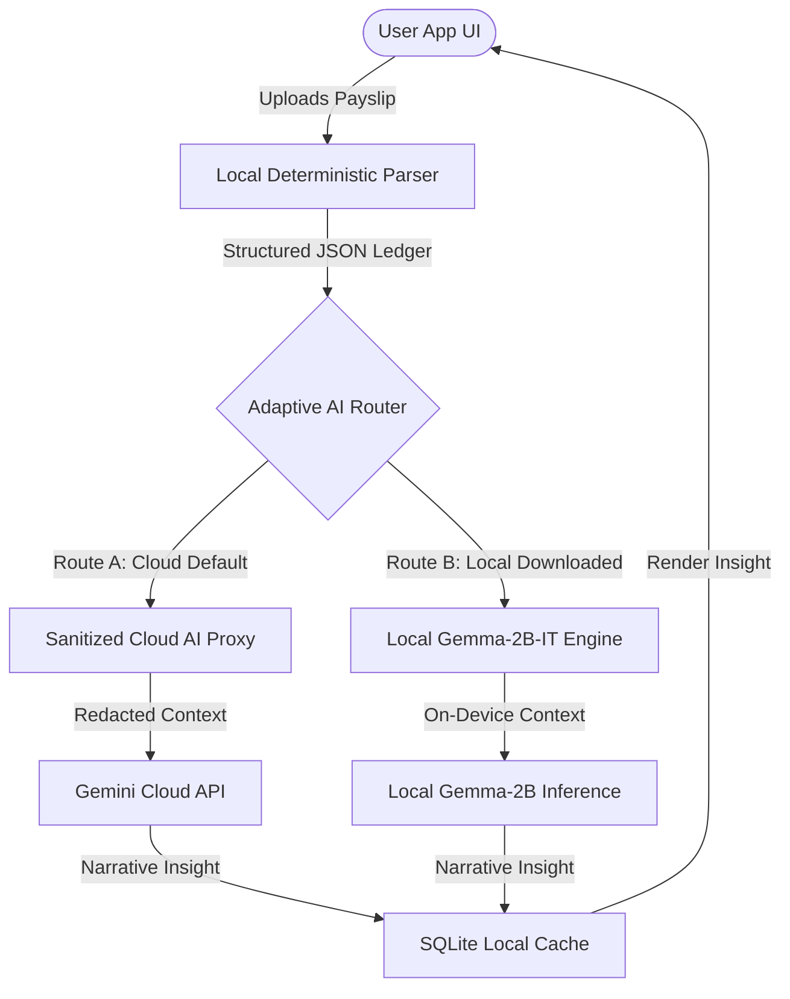
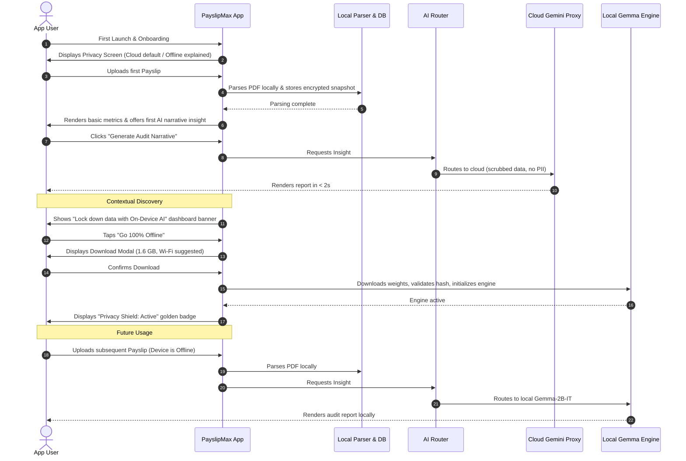

# PayslipMax AI Architecture & Offline Model Adoption Strategy

This document outlines the end-to-end product strategy, onboarding design, communication framework, user experience, and technical architecture for introducing the offline **Gemma-2B-IT** model to PayslipMax.

---

## Executive Summary

PayslipMax is a security-critical payslip auditing and financial intelligence platform designed for privacy-sensitive users (including military, defense, and government personnel). To scale compute efficiency and build absolute trust, the application is transitioning to a **Hybrid Adaptive AI Architecture**. 

This strategy balances immediate gratification (instant cloud value) with an optional, high-trust upgrade path to **100% On-Device Private AI**.



---

## 1. Product Positioning Strategy

We evaluate four positioning paths for PayslipMax's AI capabilities:

| Dimension | Option A: Cloud AI Primary | Option B: Offline AI Primary | Option C: Dual-Mode AI | Option D: Adaptive AI (Recommended) |
| :--- | :--- | :--- | :--- | :--- |
| **User Comprehension** | **High**. Standard app behavior; users understand cloud processing. | **Low**. Users are confused why a utility app requires a 1.6 GB download to start. | **Medium**. Requires users to make technical decisions during onboarding. | **High**. "Works out-of-the-box" with a clear, valuable privacy upgrade path. |
| **Trust Impact** | **Medium/Low**. Privacy-conscious defense users may hesitate to upload. | **Maximum**. Builds immediate, unshakeable trust with security cohorts. | **High**. Empowers user choice. | **High/Maximum**. Transparent sanitization by default; fully offline on upgrade. |
| **Adoption Rate** | **100%** immediate activation. | **15% - 25%** due to download failure and storage friction. | **40%** (split based on onboarding choice). | **100% Initial** / **45% Offline** adoption via progressive nudges. |
| **Technical Complexity** | **Low**. Simple REST API proxy. | **High**. Local runtime, memory allocation, and OS-specific compilation. | **Medium**. Maintain separate code paths. | **High**. Unified prompt translation and fallback orchestration. |
| **Support Burden** | **Low**. Server-side scaling. | **High**. Storage exhaustion, RAM crashes (Jetsam), device heating. | **Medium**. High triage volume. | **Managed**. Fallback mechanisms prevent broken app states. |
| **Long-Term Scalability** | **Expensive**. Infinite scale correlates with linear API cost growth. | **Infinite & Free**. Compute offloaded entirely to user hardware. | **Balanced**. | **Highly Profitable**. Scales user engagement while reducing API overhead. |

### Recommended Approach: Option D — Adaptive AI (Privacy-Shielded Cloud default with Local Upgrade)
*   **The Paradigm**: Position PayslipMax as **"Local-First, Privacy-Shielded"**.
*   **The Out-of-Box Experience**: Users run on *Sanitized Cloud AI*. A local sanitization layer ([RedactionSanitizer](file:///Users/test/Downloads/PDFParser/shared/src/commonMain/kotlin/com/ssbmax/pdfparser/insights/RedactionSanitizer.kt)) scrubs PII (names, PAN, bank accounts) before sending data.
*   **The Upgrade**: Highlight the **"Maximum Security Vault"** option, which downloads the local model to achieve 100% offline, zero-network auditing.

---

## 2. End-to-End User Journey



### Key Journey Milestones & Drop-off Mitigation
1.  **First Launch (Onboarding)**: Let users opt-in to standard mode immediately. *Risk*: Users dropping off if forced to download 1.6 GB. *Mitigation*: The download is strictly optional and deferrable.
2.  **Model Downloading**: *Risk*: Network drops, battery drain, low disk space. *Mitigation*: Use OS-level background transfer agents, check storage limit *before* download, and support pause/resume.
3.  **Model Compiling/First Load**: *Risk*: High latency or crash during model initialization. *Mitigation*: Pre-warm the model in the background when the app is launched and charging.

---

## 3. World-Class Onboarding Experience

Designed to be visually premium, copy-focused, and free of technical jargon.

````carousel
### Screen 1: The Intelligent Auditor

*   **Headline**: Your Personal Payroll Auditor.
*   **Supporting Copy**: PayslipMax automatically reviews your monthly pay statements, finding payroll errors, tax-saving opportunities, and tracking your allowances.
*   **Primary CTA**: Get Started
*   **Secondary CTA**: Learn how it works
<!-- slide -->
### Screen 2: Defense-Grade Privacy

*   **Headline**: Your Data Stays Yours.
*   **Supporting Copy**: Your pay statements are parsed and saved directly on your device. All sensitive information is locked using hardware-level encryption.
*   **Primary CTA**: Continue
*   **Secondary CTA**: Read our Privacy Commitment
<!-- slide -->
### Screen 3: Choose Your AI Experience

*   **Headline**: Choose Your AI Experience.
*   **Supporting Copy**: Start instantly using our secure, privacy-shielded cloud engine, or go completely off-the-grid by downloading our offline on-device AI.
*   **Primary CTA**: Use Secure Cloud (Instant Access)
*   **Secondary CTA**: Set Up Offline AI (Requires 1.6 GB Download)
````

---

## 4. Offline AI Discovery Strategy

Evaluating triggers for prompting the model download:

| Strategy | Expected Adoption | Friction | Understanding | Retention Impact | Recommended Use Case |
| :--- | :--- | :--- | :--- | :--- | :--- |
| **A: Ask during onboarding** | High (50%) | Very High | Low | Negative (if download fails/takes too long) | High-security enterprise/gov builds. |
| **B: Ask after first upload** | Medium (30%) | High | Medium | Neutral | Standard utility apps. |
| **C: Ask after first report** | High (40%) | Low | High | Positive | Recommended baseline. |
| **D: Ask after repeated use** | Low (15%) | Very Low | High | Highly Positive | Organic growth. |
| **E: Hybrid Progressive** | **High (45%+)** | **Very Low** | **High** | **Highly Positive** | **Optimal Baseline**. |

### Recommended Discovery Strategy: Hybrid Progressive Disclosure
1.  **Introduce during onboarding** as an optional feature. Let users skip.
2.  **Demonstrate value first** using the Sanitized Cloud.
3.  **Place contextual entry points** in the dashboard and settings:
    *   *Direct Contextual Trigger*: When network connectivity is weak or lost: "Go completely offline with On-Device AI."
    *   *The Privacy Nudge*: After 3 successful audits: "You've audited 3 payslips. Transition to 100% local processing to guarantee permanent privacy."

---

## 5. Trust & Privacy Communication System

Clear, trust-building copy examples across key application contexts:

*   **Onboarding Security Card**:
    > "We remove your name, bank account, and identifying numbers before generating insights. Your raw pay statements never leave your device."
*   **Dashboard Offline Banner**:
    > "🔒 **100% Private Auditor Available**  
    > Run audits without internet access. Protect your financial life from cloud processing. [Go Offline Now]"
*   **Empty State (Incomplete Download)**:
    > "Secure analysis is waiting. Connect to Wi-Fi to download the localized processing engine and begin your private audits."
*   **Settings Summary Copy**:
    > "PayslipMax uses a local engine running directly on your phone’s processor. Your data is encrypted at rest and never shared."

---

## 6. Premium Model Download Experience

The download screen must match Apple’s design guidelines: detailed state reflection, reassurance, and graceful failure.

```
+-------------------------------------------------+
|               Secure Offline AI                 |
|                                                 |
|  [ Glowing Golden Vault Graphic / Micro-Anim ]   |
|                                                 |
|  Downloading Local Intelligence...              |
|  [===============>-----------] 62% of 1.6 GB     |
|  Est. remaining: 2 minutes (Wi-Fi)              |
|                                                 |
|  * Your phone may get warm during setup.        |
|  * Keep the app open or lock your screen.        |
|                                                 |
|         [ Pause ]       [ Cancel ]              |
+-------------------------------------------------+
```

### Graceful Error Handling & Recovery States

#### 1. Low Storage State
*   **UX Response**: Alert pops up before starting.
*   **Copy**: "Insufficient Storage. The offline auditor requires 1.8 GB of free space to download and initialize, but only 1.2 GB is available. Please clear space in your settings."
*   **Action**: Offers a link directly to iOS/Android Storage settings.

#### 2. Network Interruption State
*   **UX Response**: Subtle warning banner; background progress suspends without failing.
*   **Copy**: "Network connection lost. Progress saved. We'll resume once you're reconnected."
*   **Action**: Auto-retry loop with exponential backoff.

#### 3. App Termination State
*   **UX Response**: The next time the user opens the app, the download state resumes from the last cached chunk.
*   **Copy**: "Resuming download... (720 MB / 1.6 GB)"

---

## 7. AI Mode Selector Design

### Recommended Model: Hybrid Routing (Intelligent Defaults with Manual Override)
We route requests through an intelligent policy layer:

```
                  [ Request Insight ]
                           │
                 Is 'Strict Privacy' On?
                 ├── Yes ──> [ Force On-Device Engine ]
                 └── No  ──> Is Model Downloaded?
                             ├── No  ──> [ Use Sanitized Cloud AI ]
                             └── Yes ──> Is Network Available?
                                         ├── No  ──> [ Force On-Device Engine ]
                                         └── Yes ──> [ Use Sanitized Cloud AI ]
                                                     (For faster, richer processing)
```

### Technical & UX Considerations
*   **Schema Consistency**: Prompt engineering must ensure both the cloud Gemini model and the local Gemma-2B-IT model output the exact same JSON schema.
*   **Quality Difference Indicator**: If local engine insights are shorter or lack advanced tax projections, display a subtle tag: "Audit completed locally."

---

## 8. Settings Architecture

The settings panel acts as the control tower for the app's intelligence layer.

```
+-------------------------------------------------+
| Settings > AI & Privacy                         |
+-------------------------------------------------+
| SECURITY PROFILE                                |
| (o) Standard (Privacy Shield Cloud)             |
| ( ) Maximum (100% On-Device Only)               |
|                                                 |
| ON-DEVICE MODEL STATUS                          |
| Status: Installed & Active                      |
| Model Version: Gemma-2B-IT v1.4.0               |
| Storage Allocated: 1.62 GB                      |
| Last Check: Today, 09:12 AM                     |
|                                                 |
| [ Update Model ]      [ Delete Model Weights ]  |
|                                                 |
| PRIVACY PROTOCOL                                |
| Local Encryption: Enabled (Hardware Keyed)      |
| Cloud Redaction: Active                         |
| Data Sharing: Disabled                          |
+-------------------------------------------------+
```

---

## 9. Lifecycle & Re-Engagement

To naturally re-engage users who skipped Offline AI initially:

*   **Contextual Network Failure Trigger**: If the user tries to run an audit while in an airplane or in a low-reception area (e.g., field deployments, ships, remote military camps):
    > "No connection? You can still audit your statements. Download the local engine to run all future analyses offline."
*   **Insights Summary Upgrade Card**: Integrate an upgrade path directly into the dashboard. When viewing a monthly summary:
    > "Make this review 100% confidential. Store the AI brain locally."

---

## 10. Model Update Strategy

To maintain user trust, weight updates must happen silently and securely.

```
             [ Scheduled Update Check ] (Charging + Wi-Fi)
                         │
                 Update Available?
                         │
         ┌───────────────┴───────────────┐
      Minor Update                  Major Update
   (e.g., Prompts/Fixes)        (e.g., Model Upgrade)
         │                               │
  [ Silent Delta Download ]      [ User Prompt / Wi-Fi ]
         │                               │
  [ Background Compile ]         [ Background Compile ]
         │                               │
  [ Swap Active Slot ]           [ Swap Active Slot ]
         │                               │
  [ Remove Old Weight ]          [ Show Notification ]
```

### Rollback Strategy — **implemented** (was: sketched)
*   **Dual-Slot Execution (A/B)**: Keep the active model weights in Slot A. Write the new download to Slot B. Run a checksum and a sanity prompt test. If it succeeds, point the engine to Slot B and delete Slot A. If it fails, keep Slot A active.
*   **As built (LiteRT-LM unification, §15):** this is no longer a sketch. `GemmaModelStorageManager`/`GemmaModelPaths` define an **active slot** (`gemma-active.litertlm`), a **staging slot** (`gemma-staging.litertlm`), and a `gemma-active.version` metadata record, all in `shared/commonMain` (one state machine, used identically by both platforms' `PdfParser.kt`). `GemmaModelVersionManager.fetchManifest()` returns the current `{version, sha256}`; `PayslipViewModelGemmaExtensions.setLocalAiEnabled` downloads a differing version into staging, `verifyStagingChecksum` runs SHA-256 (pure-Kotlin `Sha256.kt`, pinned to NIST vectors), and `promoteStagingToActive` performs an **atomic rename that overwrites the old active** (strictly better than delete-then-move for the "never half-written" guarantee) — a checksum mismatch calls `discardStaging` and leaves the active slot and recorded version untouched. Regression tests prove both directions: staging-verified→promote, and staging-checksum-fails→active-survives. (The "sanity prompt test" step above is not yet wired — checksum is the current gate; a post-promote inference smoke test is a possible future hardening, not required for correctness since a bad-bytes model fails checksum before promotion.)

---

## 11. Technical Architecture Recommendations

We outline the implementation phases from MVP to long-term scale:

```
+---------------------------------------------------------------------------------+
|                               DEVELOPMENT ROADMAP                               |
+---------------------------------------------------------------------------------+
|       MVP (Cloud + Local Stub)   |   V1 (On-Demand Gemma-2B)   |  V2 (Unified Native)  |
| ─────────────────────────────────┼─────────────────────────────┼─────────────────────── |
|  * Pre-redacted Cloud API        |  * On-Demand Dynamic Weight |  * Apple Translation  |
|  * Simple settings toggle        |    Download (CDN / Firebase)|    & LLM Frameworks   |
|  * Base local SQLite caching     |  * Local execution (ONNX)   |  * Multi-Model Packs  |
|  * Static validation schema      |  * Background download mgr  |  * Zero-copy parsing  |
+---------------------------------------------------------------------------------+
```

### MVP (Current Phase)
*   **Focus**: Solidify structured parsing and cloud API proxy.
*   **Redaction**: Local [RedactionSanitizer](file:///Users/test/Downloads/PDFParser/shared/src/commonMain/kotlin/com/ssbmax/pdfparser/insights/RedactionSanitizer.kt) strips names, PAN, bank numbers.
*   **Security**: DB encrypted using keys from `Keychain` / `Keystore`.

### V1: On-Demand Gemma Integration
*   **Dynamic Asset Delivery**: Download weights dynamically using Google Cloud Storage CDN or Firebase Dynamic Feature Delivery.
*   **Inference Engine**: Execute via **ONNX Runtime Mobile** or **Google MediaPipe LLM Inference SDK** (providing uniform Kotlin Multiplatform bindings). *Superseded — see §15: MediaPipe LLM Inference is maintenance-only/deprecated and both platforms now run on **LiteRT-LM**, implemented (not just a candidate).*
*   **Verification**: Check model SHA-256 before instantiation.
*   **Storage**: Store in App Sandbox (`NSCachesDirectory` on iOS, `cacheDir` on Android) with `URLResourceKey.isExcludedFromBackupKey` enabled to avoid iCloud storage warnings.

### V2: Unified System-Level AI
*   **Apple Foundation Model Integration**: When running on compatible hardware (iOS 18+ / M-series / Apple Intelligence), use Apple's native **LLM / Translation APIs** directly, bypass downloading Gemma weights to save 1.6 GB of space.
*   **Multi-Model Packages**: Allow users to download domain-specific models (e.g., "Tax-Optimization Specialist", "Military Allowances Auditor").

---

## 12. Metrics & Success Criteria

We track success across three major funnel indicators:

```
[ Download Clicked ] ──(Conversion Rate >65%)──> [ Download Completed ] ──(Activation Rate >95%)──> [ Active Local Auditor ]
```

### 1. Adoption Metrics
*   **Download Attempt Conversion**: (Total users who started download) / (Total users shown the offline option). Target: **>30%**.
*   **Download Completion Rate**: (Successful downloads) / (Initiated downloads). Target: **>85%** (indicates strong network resiliency and storage pre-checking).
*   **Activation Rate**: (Users who completed a local audit after download) / (Total completed downloads). Target: **>95%**.

### 2. Engagement Metrics
*   **Offline vs. Cloud Share**: The percentage of total audits run locally vs. cloud. Target: **>60%** of monthly active users.
*   **Offline Retention Lift**: 30-day cohort retention comparison between Cloud-only and Offline-active users. Target: **+15% lift** for Offline users.

### 3. Business & Financial Metrics
*   **API Cost Reduction**: Target: **50% reduction** in server-compute costs within 90 days of V1 release.
*   **Defense Subscriptions**: Growth in active users reporting military, defense, and government pay patterns.

---

## 13. Apple-Level UX Review

An audit of the strategy against premium UX and security guidelines:

### Human Interface Guidelines Compliance
*   **Friction Reduction**: Do not block user flow for downloads. Ensure the app has rich, interactive value *before* any large download.
*   **State Transparency**: The download indicator must show estimated time remaining based on active bandwidth, rather than a generic spinning circle.
*   **Storage Etiquette**: Use cached/temporary directories that the operating system can purge in extreme low-space situations, but back them up with download resume pointers.

### Risks and Mitigation Strategies
1.  **RAM Exhaustion (Jetsam termination)**: Running a 2B LLM on older hardware (e.g., iPhone 11, 4GB RAM) can cause OS crashes.
    *   *Mitigation*: Check device memory profile at startup. If RAM is <6GB, display a warning card or restrict local AI to optimized 1-bit/2-bit quantized models.
2.  **App Store Rejection (On-demand execution)**: Apple strictly scrutinizes dynamic asset execution.
    *   *Mitigation*: Position the model as data weights, not executable binary code. Use static ONNX/MediaPipe framework bundles embedded in the binary to execute the model data.

---

## 14. Final Executive Recommendation

### 1. Selected AI Architecture
Adopt a **Hybrid-Adaptive Routing** setup. The default mode uses a highly sanitized Cloud API proxy. When the local model is downloaded, the app automatically transitions to local processing, falling back to the cloud only if the user explicitly permits it when offline processing is overloaded.

### 2. Recommended Onboarding
Keep onboarding lean: Introduce the platform's security and privacy principles first, followed by a screen explaining the two AI options. The default choice should be the secure cloud proxy, keeping the initial App Store download small and getting the user to value in under 3 minutes.

### 3. Messaging Framework
Remove all technical jargon. Focus on user benefit: **"Instant Secure Cloud"** vs. **"100% Confidential Device-Only Vault."**

### 4. MVP → V1 → V2 Roadmap
*   **MVP (Current)**: Implement local SQLite caching and structured deterministic rules. Use redacted cloud proxies for narrative insights.
*   **V1 (3 Months)**: Build on-demand weight downloading (1.6 GB) using MediaPipe/ONNX, enabling fully offline local execution.
*   **V2 (9 Months)**: Integrate Apple Intelligence native LLM APIs for supported devices, eliminating model download size entirely.

### 5. Target KPIs
*   **30%** of Cloud-active users convert to Offline AI within 30 days.
*   **90%** download completion rate using background session recovery.
*   **50%** reduction in narrative API costs by month 3.

---

## 15. On-Device Inference Runtime — LiteRT-LM, **built out on both platforms** (was: deferred spike)

**Status now:** real on-device Gemma inference runs on **both** Android and iOS through Google's supported
**LiteRT-LM** runtime, downloaded via one version-aware dual-slot pipeline backed by a Firebase-Hosting/GCS
model cache. This supersedes the earlier "deferred spike" framing of this section: the three interop
questions that gated a build-out are all answered below, and the runtime is implemented (see
`docs/AI_INSIGHTS_PIPELINE.md` §2 Stage 6 + §11 Changelog for the parser-side view). The iOS
`GemmaEngine.ios.kt` no longer returns `Result.failure(NotImplementedError(...))` — it bridges to a real
Swift LiteRT-LM engine; it now fails only if its delegate was never registered (a wiring bug, not a
deliberate stub).

**Why LiteRT-LM and not MediaPipe:** Android's previous runtime, MediaPipe's `LlmInference`
(`com.google.mediapipe.tasks.genai.llminference`), does ship an iOS/Swift artifact — but the entire MediaPipe
LLM Inference API is **maintenance-only/deprecated on both platforms**. Rather than add new iOS work on top
of a sunsetting dependency, both platforms were migrated to LiteRT-LM (stable Android Maven artifact + a
genuine Swift Package with Metal GPU acceleration) in one coordinated effort.

**The three interop questions — answered:**
1. **Kotlin/Native ⇄ LiteRT-LM Swift Package → Swift-side bridge, not `cinterop`.** LiteRT-LM's iOS package
   is pure Swift with no Objective-C headers, so Kotlin/Native `cinterop` cannot bind it. The build uses the
   established KMP pattern: `GemmaEngine.ios.kt` exposes a companion `inferenceDelegate` closure (mirroring
   `AuthTokenProvider.ios.kt`), a native Swift wrapper `GemmaInferenceBridge.swift` implements it against
   LiteRT-LM's `Engine`/`Conversation` Swift API, and it is registered at app startup in `iOSApp.swift`.
2. **Model format → the unified `.litertlm` build, not the old `.task`.** Both platforms download the
   *identical* generic CPU/GPU int4 file `gemma3-1b-it-int4.litertlm` (~529MB). The NPU-optimized
   Android-only variant was deliberately rejected to preserve SSOT (one file, one code path). The download
   pipeline's `verifyModelFile` gate was flipped from `.task` to `.litertlm` accordingly.
3. **Scope → Android migrated too, in the same effort.** Because MediaPipe is deprecated on Android as well,
   Android's `GemmaEngine.android.kt` was rewritten onto the same LiteRT-LM `Engine`/`Conversation` API
   (`com.google.ai.edge.litertlm:litertlm-android`) — one current runtime across both platforms, rather than
   iOS adopting a newer runtime while Android stayed on the deprecated one. This required a verified toolchain
   bump (Kotlin 2.0.21→2.2.x, AGP/Compose aligned), since no published LiteRT-LM AAR loads under 2.0.21.

**Backend / access control:** the model is served from a private GCS bucket behind Firebase Hosting (a thin
`serveGemmaModel` function streams it with `immutable` `Cache-Control` for edge caching); a `refreshGemmaModelCache`
Cloud Function authenticates to Hugging Face via Secret Manager and SHA-256-verifies before publishing; a
`gemmaModelManifest` endpoint returns `{version, url, sha256, noticeText, noticeUrl}`. The manifest is gated by
a **constant-time interim shared-key check** — explicitly a temporary safeguard **weaker than real Firebase
App Check** (Play Integrity / App Attest), which is blocked until both apps are properly registered/signed in
Play Console and App Store Connect. Upgrading to real App Check is a tracked fast-follow, not silently dropped.
The Gemma Terms-of-Use notice travels in the manifest (`noticeText`/`noticeUrl`) and is surfaced in the
local-AI settings copy before download, satisfying the license's redistribution-notice requirement.

**One honest, non-gradle-verifiable gap:** no gradle task compiles the `.xcodeproj`, so "Swift bridge compiles
against the real LiteRT-LM API" and "SPM package resolves" were verified against Google's official Swift docs,
not by a build. End-to-end compile + a real on-device run (manifest fetch → ~529MB staging download → checksum
→ atomic promote → model load → real inference → forced-mismatch rollback leaving active untouched) is a
**manual on-device smoke test**, matching this project's existing pattern for anything needing a live
network/model call.

Sources: [LLM Inference guide for iOS](https://developers.google.com/edge/mediapipe/solutions/genai/llm_inference/ios), [LiteRT-LM Swift API](https://developers.google.com/edge/litert-lm/swift), [LiteRT-LM Overview](https://developers.google.com/edge/litert-lm/overview), [google-ai-edge/LiteRT-LM](https://github.com/google-ai-edge/LiteRT-LM).
