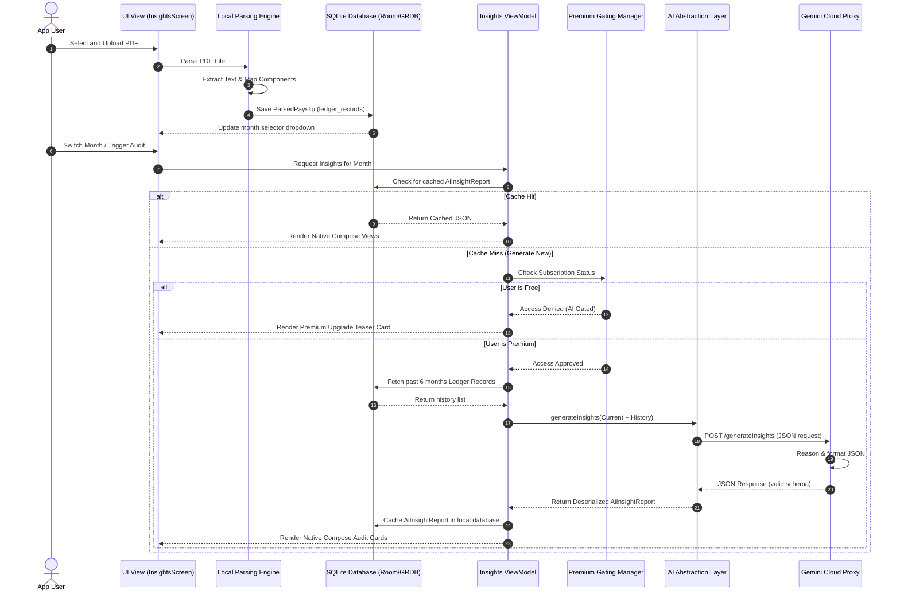

# 01. User Journey & Sequence Diagrams

This document details the end-to-end user journey in PayslipMax and outlines the sequence of component interactions.

---

## High-Level User Journey Steps

### 1. User Uploads Payslip PDF
The user selects a monthly PDF payslip generated by the PCDA(O) portal and uploads it through the PayslipMax mobile application interface.

### 2. PDF Parsing Process
The client app receives the file and triggers the PDF parsing engine. The system decrypts the PDF (using user credentials if protected) and extracts the raw textual structures.

### 3. Structured Salary Extraction
The parsing engine maps the text chunks against known pay structures (Basic Pay, DA, MSP, TPTA, DSOP subscription, Income Tax). It builds a structured JSON representation of the payslip.

### 4. Local Database Storage
The parsed JSON payload is written to the local SQLite database via Room (on Android) or SwiftData/GRDB (on iOS). This updates the `ledger_records` and `financial_insights` tables.

### 5. Historical Payslip Accumulation
With every monthly upload, the system appends a new record. Over time, this builds an accrued chronological record of the user's pay changes and tax trajectories.

### 6. AI Insight Generation Trigger
When a new month is parsed, the app triggers the Insight Engine to generate audits. This can run automatically for the latest month or manually when the user requests it.

### 7. Premium Feature Gating
The Insight Engine checks the user's subscription status. 
- **Free users** are shown local calculations (basic graphs, health score dial, and raw anomaly triggers).
- **Premium users** unlock the advanced AI CA audit, claim drafts, and retirement simulators.

### 8. Insight Delivery
For premium users, the payload is compiled (including historical ledger context) and sent through the AI abstraction layer. The resulting structured JSON is parsed natively to display styled compose components (tables, badges, action items).

### 9. Historical Insight Retrieval
Generated insights are cached locally. When switching months using the top-bar dropdown, cached insights are retrieved immediately from the local SQLite database without triggering redundant LLM calls.

---

## Interaction Sequence Diagram

The interaction flow below details how these stages coordinate across the client, database, and backend:

