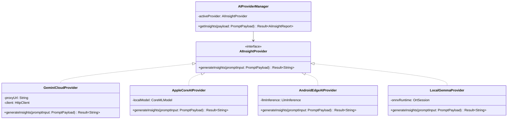
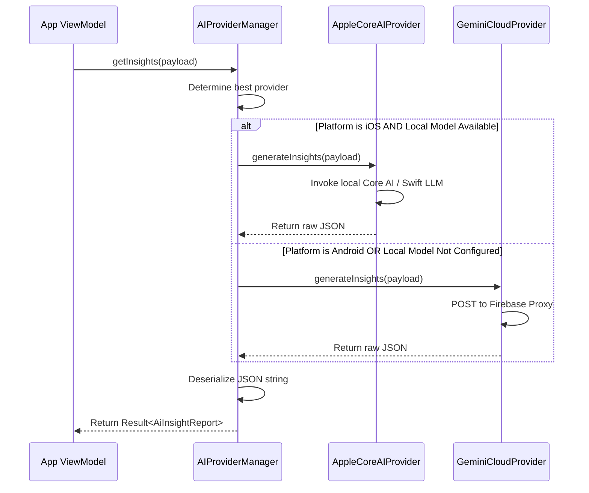

# 04. AI Provider Abstraction Layer

This document outlines the architecture designed to decouple PayslipMax's core logic from specific AI models, enabling seamless transitions from cloud APIs (Gemini) to local, on-device AI engines (Apple Core AI, Android AI Edge, Gemma).

---

## 1. Provider Abstraction Contract

By wrapping AI logic in a standard contract interface, the presentation and repository layers are insulated from changes in API SDKs or local runtimes.



---

## 2. Kotlin Interface Definition

```kotlin
package com.payslipmax.pdfparser.insights

import com.payslipmax.pdfparser.database.LedgerRecordEntity
import com.payslipmax.pdfparser.domain.ParsedPayslip
import kotlinx.serialization.Serializable

/**
 * Common payload structure independent of target model API.
 */
@Serializable
data class PromptPayload(
    val currentMonthRawText: String,
    val sanitizedJsonData: String,
    val historicalSummaryText: String,
    val anomaliesCount: Int,
    val sanitizedPayslip: ParsedPayslip,
    val engineResult: EngineResult,
    val history: List<LedgerRecordEntity> = emptyList(),
    val authToken: String? = null
)

/**
 * Interface contract defining the AI execution engine.
 */
interface AIInsightProvider {
    /**
     * Executes the text generation request.
     * Returns a Result containing the raw JSON response string or an execution error.
     */
    suspend fun generateInsights(payload: PromptPayload): Result<String>
}
```

---

## 3. Execution & Selection Flow

The `AIProviderManager` evaluates network conditions, platform capabilities (iOS vs. Android), and user preferences to select and delegate work to the correct provider:



---

## 4. How Migrations Occur Without Rewriting Business Logic
1. **Separation of Concerns**: The ViewModel and UI only interact with `AIProviderManager` and the structured `AiInsightReport` KMP data class.
2. **Provider Swapping**: To add a new local model (e.g., Llama-3-8B running via ONNX on Android), developers create a new class implementing `AIInsightProvider` and register it inside `AIProviderManager`'s dependency resolver.
3. **No UI Changes**: The layout code doesn't care whether the JSON was generated in Google Cloud, in iOS Core AI, or by Gemma on an Android SoC. The output JSON schema is strictly verified, making the integration fully plug-and-play.
